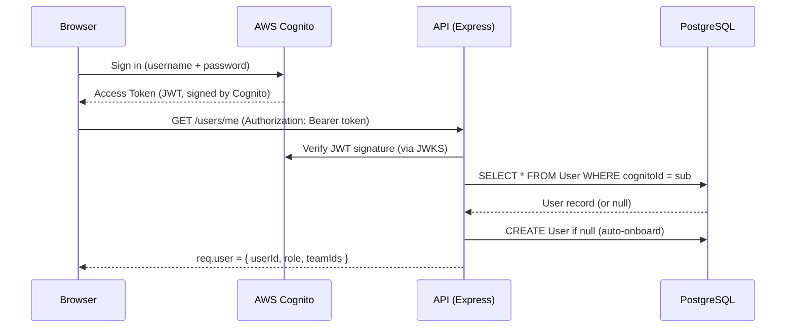
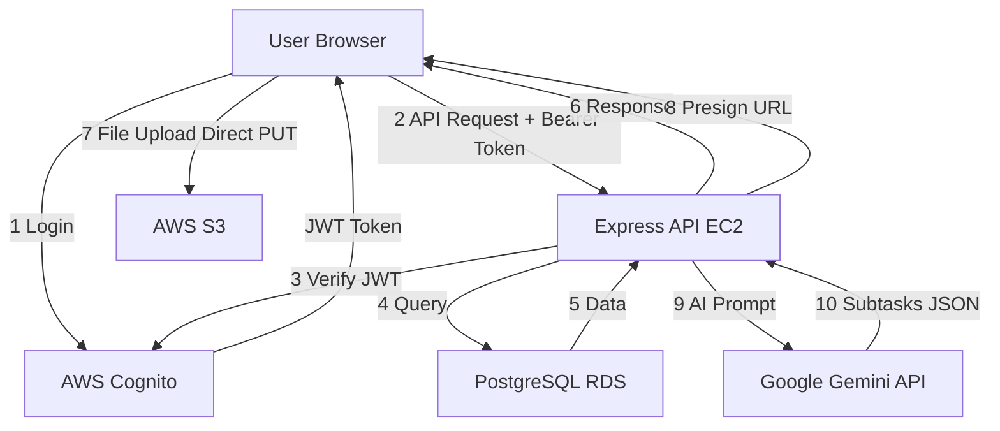
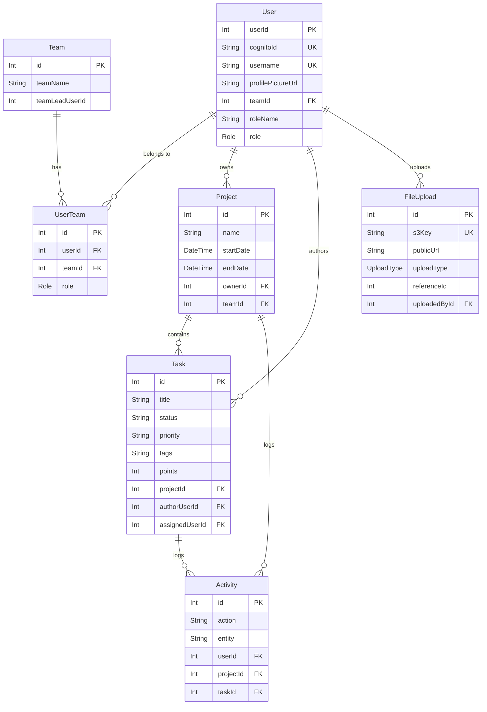

# TaskMatrix — Complete Viva Preparation Guide

> **Generated from live codebase analysis** on 2026-06-28.
> Source of truth: the actual implementation files.
> Where documentation differs from code, the code wins.

---

## Table of Contents

1. [Project Summary](#1-project-summary)
2. [Project Architecture](#2-project-architecture)
3. [Folder Wise Explanation](#3-folder-wise-explanation)
4. [Important File Guide](#4-important-file-guide)
5. [Feature Wise Explanation](#5-feature-wise-explanation)
6. [API Documentation](#6-api-documentation)
7. [Database Deep Dive](#7-database-deep-dive)
8. [Component Dependency Map](#8-component-dependency-map)
9. [Execution Flow](#9-execution-flow)
10. [Top 100 Viva Questions](#10-top-100-viva-questions)
11. [External Examiner Questions](#11-external-examiner-questions)
12. [Interview Questions](#12-interview-questions)
13. [Project Improvements](#13-project-improvements)
14. [How to Explain Every Folder](#14-how-to-explain-every-folder)
15. [Learning Roadmap](#15-learning-roadmap)
16. [Mock Viva](#16-mock-viva)
17. [Revision Notes](#17-revision-notes)

---

# 1. Project Summary

## 30-Second Explanation

TaskMatrix is a full-stack project management web application similar to Jira or Trello. It lets teams create projects, manage tasks across Kanban/List/Table/Gantt views, collaborate via comments, upload files to AWS S3, and uses Google Gemini AI to automatically break down complex tasks into subtasks. The frontend is built with Next.js and Redux, the backend is an Express REST API, data lives in PostgreSQL via Prisma ORM, and authentication is handled by AWS Cognito.

---

## 2-Minute Explanation

TaskMatrix is a comprehensive project management dashboard built as a monorepo with two workspaces — a `client/` (Next.js 14 frontend) and a `server/` (Node.js + Express backend).

**Key capabilities:**
- Users sign in through AWS Cognito (handles sign-up, login, and JWT issuance)
- They can create **Projects** and organize **Tasks** across four views: Board (Kanban with drag-and-drop), List, Table (MUI DataGrid), and Timeline (Gantt chart)
- Tasks have status, priority, story points, tags, dates, assignee, comments, and file attachments
- Files (profile pictures, task attachments, project documents) are uploaded directly to **AWS S3** using presigned URLs — the server never handles file bytes
- Google **Gemini 2.5 Flash** AI can analyze a task title/description plus current team workload and auto-generate between 3-7 intelligent subtasks with assignments, priorities, and story points
- A global **Activity Log** records every create/update action for audit purposes
- Users are organized into **Teams**, which are linked to Projects
- A **Search** endpoint queries tasks, projects, and users simultaneously
- The **Dashboard/Home** shows KPI cards, charts (Recharts), and recently assigned tasks

The backend uses **Prisma ORM** with PostgreSQL (hosted on AWS RDS). Every API route is protected by `authMiddleware` which cryptographically verifies the Cognito JWT using `aws-jwt-verify`, then auto-creates users in the DB on first login.

---

## 5-Minute Explanation

### The Problem It Solves
Teams working on software projects need a centralized place to track work, assign responsibilities, monitor progress, and communicate. TaskMatrix provides this in a single full-stack application.

### Architecture Overview

| Tier | Technology | Hosting |
|------|-----------|---------|
| Frontend | Next.js 14 (App Router) | AWS Amplify / Vercel |
| Backend API | Node.js + Express 4 | AWS EC2 |
| Database | PostgreSQL (Prisma ORM) | AWS RDS |
| Authentication | AWS Cognito | AWS managed |
| File Storage | AWS S3 | AWS managed |
| AI | Google Gemini 2.5 Flash | Google Cloud |

### Frontend
- Built with **Next.js 14 App Router** — all pages use `"use client"` since the dashboard is highly interactive
- State management uses **Redux Toolkit** for UI state (dark mode, sidebar collapse) and **RTK Query** for all API calls
- RTK Query automatically injects Bearer tokens in every request via `prepareHeaders`
- UI uses **TailwindCSS** for styling, **MUI DataGrid** for table views, **Recharts** for charts, **gantt-task-react** for timeline, and **react-dnd** for drag-and-drop
- **Redux Persist** saves UI state (dark mode preference, sidebar state) to localStorage

### Backend
- **Express.js** REST API with 14 route groups (projects, tasks, search, users, teams, activities, uploads, ai)
- Three-layer middleware pipeline: `validateIdParam` → `requireEntityExists` → controller
- Auth uses `aws-jwt-verify` to cryptographically verify Cognito JWTs — no shared secrets needed
- If a valid JWT belongs to a user not yet in the DB, the middleware **auto-onboards** that user silently
- Role-based access: ADMIN sees all data; MEMBER sees only their owned projects and assigned tasks

### Database
- 11 models: User, Team, UserTeam, Project, ProjectTeam, Task, TaskAssignment, Attachment, Comment, Activity, FileUpload
- Cascade deletes are configured at the database level — deleting a project cascades to all its tasks, comments, attachments, and activity logs

### Key Design Decisions
1. **Presigned URL upload flow** — browser uploads files directly to S3, Express only handles metadata
2. **RTK Query cache tags** — mutations automatically invalidate the relevant cache entries
3. **AI request deduplication** — an in-memory Set prevents duplicate concurrent Gemini requests
4. **Auto-onboarding** — any valid Cognito user is automatically created in the DB on first request

---

## 10-Minute Explanation

*(Covers everything in the 5-minute explanation, plus:)*

### Authentication Deep Dive
1. User opens the app → sees the `AuthProvider` which renders the AWS Amplify `Authenticator` UI component
2. User signs in → Cognito issues an **Access Token** (JWT signed with Cognito's private key)
3. Every RTK Query request calls `fetchAuthSession()` in `prepareHeaders`, gets the Access Token, and adds `Authorization: Bearer <token>`
4. Express `authMiddleware` uses `CognitoJwtVerifier.create({userPoolId, clientId})` to verify the token's signature (via JWKS endpoint), issuer, clientId, and expiry
5. The `sub` claim (Cognito user ID) is extracted, and the DB is queried for a matching `User.cognitoId`
6. If not found → auto-create user as MEMBER role
7. `req.user = { userId, role, teamIds[] }` is attached for all downstream controllers

### State Management Deep Dive
- **Global slice** (`state/index.ts`): `isSidebarCollapsed`, `isDarkMode`, `isCompactMode` — persisted to localStorage via `redux-persist`
- **API slice** (`state/api.ts`): All server data. RTK Query caches responses by tag. When you `createProject`, it invalidates the `"Projects"` tag, causing any component using `useGetProjectsQuery` to automatically refetch
- Types were extracted from `api.ts` into `src/types/index.ts` for cleaner separation of concerns

### S3 Upload Flow Detail

```
Client                    Express Server              AWS S3
  |                           |                         |
  |-- POST /uploads/presign -->|                         |
  |<-- { uploadUrl, s3Key } ---|                         |
  |                           |                         |
  |-- PUT (file binary) ------>|------------------------>|
  |                           |                   File stored
  |                           |                         |
  |-- POST /uploads/confirm -->|                         |
  |                      Saves FileUpload row in DB      |
  |<-- { FileUpload record } --|                         |
```

The `useS3Upload` hook manages this 3-step flow, reporting progress at 33%, 66%, 100%.

### AI Task Breakdown Flow
1. User fills in task title + description and clicks "AI Breakdown"
2. Frontend calls `POST /ai/breakdown` with `{ title, description, projectId, minTasks, maxTasks }`
3. Backend fetches the project's associated teams (via `ProjectTeam → Team → User`)
4. For each team member, aggregates their current active story points
5. Constructs a structured prompt for Gemini with team member roles + workloads
6. Gemini returns a JSON array (enforced by `responseSchema`) of subtask objects
7. Server enforces max count, returns to client

---

# 2. Project Architecture

## Frontend Architecture

```
Browser
  |
  +-- Next.js 14 (App Router)
       |
       +-- layout.tsx (root: Inter font, DashboardWrapper)
       |
       +-- DashboardWrapper
       |    +-- StoreProvider (Redux + Persist)
       |    +-- AuthProvider (AWS Amplify Authenticator)
       |    +-- DashboardLayout (Sidebar + Navbar + children)
       |
       +-- Page Components (app/home, app/projects/[id], etc.)
            |
            +-- RTK Query hooks (useGetTasksQuery, etc.)
            +-- Redux selectors (useAppSelector)
            +-- UI components (TaskCard, Modal*, etc.)
```

## Backend Architecture

```
Express Server (port 3000 / 8000)
  |
  +-- Middleware stack (applied globally)
  |    +-- helmet (security headers)
  |    +-- cors (cross-origin requests)
  |    +-- morgan (HTTP logging)
  |    +-- bodyParser (JSON parsing)
  |    +-- authMiddleware (JWT verify + user lookup)
  |
  +-- Route layer (8 route groups)
  |    +-- validateIdParam (param sanitization)
  |    +-- requireEntityExists (pre-fetch for 404 guards)
  |    +-- controller function
  |
  +-- Controller layer (business logic)
  |    +-- prisma.*.findMany / create / update / delete
  |
  +-- Services (s3Service.ts --> AWS SDK)
       +-- Gemini AI (aiController.ts --> @google/genai)
```

## Authentication Flow



## Redux / RTK Query Architecture

```
Redux Store
  +-- global (UI state -- persisted to localStorage)
  |    +-- isSidebarCollapsed: boolean
  |    +-- isDarkMode: boolean
  |    +-- isCompactMode: boolean
  |
  +-- api (RTK Query -- server state, ephemeral)
       +-- Cache: Projects, Tasks, Users, Teams, Activities, AuthUser, FileUploads
       +-- Auto-invalidation on mutations
```

## AWS Cloud Architecture

```
Internet
  |
  +-- AWS Amplify (or Vercel): Next.js Frontend
  |
  +-- AWS Cognito: User Pool --> JWT tokens
  |
  +-- AWS EC2: Express API (PM2 managed)
  |         +-- Connects to RDS + S3 + Gemini
  |
  +-- AWS RDS: PostgreSQL database
  |
  +-- AWS S3: Files (profile-pictures/, task-attachments/, project-documents/)
```

## Data Flow Diagram



## Request Lifecycle

1. Component mounts → RTK Query hook called (e.g., `useGetTasksQuery`)
2. RTK Query checks cache — if fresh, returns cached data immediately
3. If stale/missing → fires HTTP request via `fetchBaseQuery`
4. `prepareHeaders` is called → `fetchAuthSession()` gets JWT → `Authorization: Bearer` header set
5. Express receives request → runs global middleware chain
6. `authMiddleware` → verifies JWT → attaches `req.user`
7. Route middleware (`validateIdParam`, `requireEntityExists`) runs
8. Controller executes Prisma query → gets data from PostgreSQL
9. Response sent → RTK Query caches it with tag
10. Any later mutation that invalidates the tag triggers automatic refetch

---

# 3. Folder Wise Explanation

## 3.1 `client/src/app/` — Next.js App Router

**Purpose:** Contains all pages/routes of the application using the Next.js 14 App Router convention.

**Sub-routes:**

| Folder | Route | Purpose |
|--------|-------|---------|
| `home/` | `/home` | Dashboard: KPIs, charts, assigned tasks |
| `projects/` | `/projects` | Projects list (MUI DataGrid) |
| `projects/[id]/` | `/projects/:id` | Project detail: Board/List/Table/Timeline |
| `tasks/` | `/tasks` | My tasks page |
| `teams/` | `/teams` | Teams management |
| `teams/[id]/` | `/teams/:id` | Team detail page |
| `timeline/` | `/timeline` | Global Gantt timeline |
| `search/` | `/search` | Global search results |
| `users/` | `/users` | Users list |
| `profile/` | `/profile` | User profile with photo upload |
| `settings/` | `/settings` | App settings (dark mode, compact mode) |
| `priority/urgent/` | `/priority/urgent` | Tasks filtered by Urgent priority |
| `priority/high/` | `/priority/high` | Tasks filtered by High priority |
| `priority/medium/` | `/priority/medium` | Tasks filtered by Medium priority |
| `priority/low/` | `/priority/low` | Tasks filtered by Low priority |
| `priority/backlog/` | `/priority/backlog` | Tasks in Backlog |
| `welcome/` | `/welcome` | Welcome/onboarding page |

**Major files:**

| File | Role |
|------|------|
| `layout.tsx` | Root HTML wrapper, applies Inter font, wraps in DashboardWrapper |
| `authProvider.tsx` | Renders AWS Amplify Authenticator; blocks children until logged in |
| `dashboardWrapper.tsx` | Composes StoreProvider + AuthProvider + DashboardLayout |
| `redux.tsx` | Configures Redux store, redux-persist, exports typed hooks |
| `globals.css` | Global Tailwind base styles, Gantt chart CSS overrides |

**Common viva questions:**
- What is the App Router in Next.js 14?
- Why are all pages marked `"use client"`?
- How does `layout.tsx` differ from `page.tsx`?

---

## 3.2 `client/src/components/` — Reusable UI Components

**Purpose:** Shared, reusable React components that appear across multiple pages.

| Component | Purpose |
|-----------|---------|
| `Sidebar/` | Left navigation panel with project links, collapse state from Redux |
| `Navbar/` | Top bar with search, dark mode toggle, user avatar |
| `Header/` | Page-level heading component |
| `TaskCard/` | Card displayed in BoardView; shows task details |
| `Modal/` | Base modal overlay wrapper |
| `ModalNewTask/` | Form to create a new task |
| `ModalEditTask/` | Form to edit task details |
| `ModalAssignTask/` | Form to assign a task to a different user |
| `TaskDetailsModal/` | Full task detail view in a modal |
| `EmptyState/` | Shown when a list has no items |
| `FileUploader/` | Drag-and-drop file upload using `useS3Upload` hook |
| `data-table/` | Generic data table wrapper |

---

## 3.3 `client/src/state/` — Redux State Management

| File | Purpose |
|------|---------|
| `index.ts` | Global Redux slice — UI state (sidebar, dark mode, compact mode) |
| `api.ts` | RTK Query API slice — all backend endpoints, 20+ generated hooks |

---

## 3.4 `client/src/types/` — TypeScript Type Definitions

**`index.ts` exports:**
- `Project`, `Task`, `User`, `Team`, `TeamMember`, `Activity`, `FileUpload`
- `Attachment`, `PresignedUrlResult`, `AIBreakdownSubtask`, `SearchResults`
- `Priority` enum (Urgent, High, Medium, Low, Backlog)
- `Status` enum (To Do, Work In Progress, Under Review, Completed)
- `UploadTypeKey` type

**Why separated from `api.ts`:** Allows types to be imported without the entire RTK Query API slice, avoiding circular dependencies.

---

## 3.5 `client/src/hooks/` — Custom React Hooks

**`useS3Upload.ts`:**
- Manages the 3-step S3 upload flow (presign → PUT → confirm)
- Tracks `isUploading`, `progress` (0/33/66/100), `error`
- Client-side validation (MIME type, file size) before any API call
- Returns `{ upload, isUploading, progress, error, reset }`

---

## 3.6 `client/src/lib/` — Utility Functions

**`utils.ts` exports:**
- `formatDate(date)` — formats ISO dates as DD/MM/YYYY
- `dataGridClassNames` — MUI DataGrid CSS class names for dark/light mode
- `dataGridSxStyles(isDarkMode)` — MUI DataGrid `sx` styles object
- `rolePalette` — color scheme mapping for user role badges
- `getRoleStyle(role)` — returns Tailwind classes for a role string
- `getStatusBadgeClass(status)` — returns CSS class for task status badge
- `getPriorityBadgeClass(priority)` — returns CSS class for priority badge

---

## 3.7 `server/src/controllers/` — Business Logic

| Controller | Handles |
|-----------|---------|
| `projectController.ts` | CRUD for projects + access control |
| `taskController.ts` | CRUD for tasks + status updates |
| `userController.ts` | User list, current user, profile picture |
| `teamController.ts` | Team CRUD + member management |
| `searchController.ts` | Cross-entity search (tasks + projects + users) |
| `activityController.ts` | Activity stream (last 20 events) |
| `uploadController.ts` | S3 presign + confirm + list |
| `aiController.ts` | Gemini AI task breakdown |

---

## 3.8 `server/src/routes/` — HTTP Route Definitions

**Pattern:** `router.METHOD(path, ...middlewares, controllerFn)`

**Middlewares used:**
- `validateIdParam("paramName")` — validates param is a valid integer
- `requireProjectExists` — fetches project, attaches to `res.locals.project`, or 404
- `requireTaskExists` — fetches task + project, attaches to `res.locals.task`, or 404
- `requireTeamExists` — fetches team, attaches to `res.locals.team`, or 404

---

## 3.9 `server/src/middleware/` — Express Middleware

| File | Purpose |
|------|---------|
| `auth.ts` | JWT verification, user lookup, auto-onboard, `req.user` attachment |
| `validate.ts` | `validateIdParam` — integer validation for URL params |
| `entityExistence.ts` | `requireProjectExists`, `requireTaskExists`, `requireTeamExists` |

---

## 3.10 `server/src/services/` — Shared Services

**`s3Service.ts`:**
- `generatePresignedUploadUrl()` — creates S3 key, generates 60-second presigned PUT URL
- `deleteS3Object(s3Key)` — deletes an S3 object
- `ALLOWED_MIME_TYPES` — readonly array of permitted MIME types (images + PDF + docs)
- `MAX_FILE_SIZE_BYTES` — 5 MB limit
- S3 key format: `{folder}/{referenceId}/{uuid}-{sanitizedFilename}`

---

## 3.11 `server/prisma/` — Database Schema & Seeding

| File | Purpose |
|------|---------|
| `schema.prisma` | Defines all models, enums, relations, cascade behaviors |
| `seed.ts` | Populates DB with initial teams, users, projects, tasks from JSON files |
| `migrations/` | Prisma migration history (one file per migration) |
| `seedData/` | JSON data files for seeding |

---

# 4. Important File Guide

## `client/src/app/layout.tsx`

| Attribute | Detail |
|-----------|--------|
| **Purpose** | Root HTML layout wraps the entire Next.js app |
| **When it executes** | On every page load and navigation |
| **What it imports** | `DashboardWrapper`, `Inter` font, `globals.css` |
| **What happens if removed** | App crashes — Next.js requires a root layout |
| **Simple explanation** | The "frame" of the entire app — sets font and wraps everything |
| **Technical explanation** | Server Component (no `"use client"`) that provides the root HTML structure |
| **Interview question** | Why is `layout.tsx` a Server Component but `dashboardWrapper.tsx` is a Client Component? |

---

## `client/src/app/dashboardWrapper.tsx`

| Attribute | Detail |
|-----------|--------|
| **Purpose** | Composes Redux store, auth, and layout into one wrapper |
| **What it imports** | `Navbar`, `Sidebar`, `AuthProvider`, `StoreProvider` |
| **Who imports it** | `layout.tsx` |
| **What happens if removed** | No Redux store, no authentication, no sidebar/navbar |
| **Key logic** | Reads `isDarkMode` and `isCompactMode` from Redux; applies "dark" and "compact" classes to `document.documentElement` |
| **Technical explanation** | Composition root: `StoreProvider` (Redux) > `AuthProvider` (Cognito) > `DashboardLayout` (UI grid) |

---

## `client/src/app/redux.tsx`

| Attribute | Detail |
|-----------|--------|
| **Purpose** | Configure and provide the Redux store to the entire app |
| **Key configuration** | Combines `globalReducer` + `api.reducer`; configures `redux-persist` with `whitelist: ["global"]` |
| **What happens if removed** | No state management — RTK Query hooks won't work, dark mode won't persist |
| **Interview question** | Why use `redux-persist`? What does `whitelist: ["global"]` mean? Only the `global` slice is persisted to localStorage; the `api` cache is ephemeral. |

---

## `client/src/state/api.ts`

| Attribute | Detail |
|-----------|--------|
| **Purpose** | RTK Query API slice — defines every endpoint the frontend calls |
| **What it imports** | AWS Amplify `fetchAuthSession`, all types from `@/types` |
| **Key feature** | `prepareHeaders` automatically injects JWT on every request |
| **Cache tags** | Projects, Tasks, Users, Teams, AuthUser, Activities, FileUploads |
| **What happens if removed** | All API calls break — no data fetching anywhere |
| **Technical explanation** | RTK Query `createApi` with `fetchBaseQuery`; each endpoint defines query/mutation, cache tags, and invalidation logic |
| **Interview question** | How does cache invalidation work in RTK Query? |

---

## `server/src/middleware/auth.ts`

| Attribute | Detail |
|-----------|--------|
| **Purpose** | Cryptographically verify Cognito JWT; attach `req.user` |
| **When it executes** | On every non-OPTIONS request |
| **Key library** | `aws-jwt-verify` — uses Cognito's public JWKS endpoint |
| **Auto-onboard logic** | If JWT valid but user not in DB → create new MEMBER user |
| **What it attaches** | `req.user = { userId, role, teamIds[] }` |
| **Also exports** | `requireRole(...allowedRoles)` — role-based middleware factory |
| **Interview question** | What does `aws-jwt-verify` check? Signature via JWKS, issuer, clientId/audience, expiry |

---

## `server/src/services/s3Service.ts`

| Attribute | Detail |
|-----------|--------|
| **Purpose** | AWS S3 integration — presigned URL generation, file deletion |
| **Key exports** | `generatePresignedUploadUrl`, `deleteS3Object`, `ALLOWED_MIME_TYPES`, `MAX_FILE_SIZE_BYTES` |
| **S3 key format** | `{folder}/{referenceId}/{uuid}-{sanitized-filename}` |
| **Presign expiry** | 60 seconds |
| **Auth** | Uses EC2 IAM role if no explicit AWS keys; falls back to env vars |
| **Interview question** | What is a presigned URL? A time-limited URL with embedded AWS credentials that allows direct access to a specific S3 operation without exposing AWS keys to the client. |

---

## `server/prisma/schema.prisma`

| Attribute | Detail |
|-----------|--------|
| **Purpose** | Defines the PostgreSQL schema as Prisma models |
| **Models count** | 11 models |
| **Enums** | `Role` (ADMIN/MANAGER/MEMBER), `UploadType` (PROFILE_PICTURE/TASK_ATTACHMENT/PROJECT_DOCUMENT/GENERAL) |
| **Binary targets** | `native` + `rhel-openssl-3.0.x` (EC2 Linux compatibility) |
| **What happens if changed** | Must run `prisma migrate dev` to update the DB schema |

---

## `server/src/controllers/aiController.ts`

| Attribute | Detail |
|-----------|--------|
| **Purpose** | Gemini AI integration for task breakdown |
| **Model used** | `gemini-2.5-flash` |
| **Response format** | JSON enforced by `responseSchema` (Gemini structured output) |
| **Deduplication** | `activeRequests` Set keyed by `projectId_taskTitle` prevents duplicate calls |
| **Workload context** | Fetches active story points per team member using `prisma.task.aggregate` |
| **Interview question** | How do you prevent users from spamming the AI endpoint? In-memory lock + try/finally to always release. |

---

# 5. Feature Wise Explanation

## 5.1 Authentication

**Purpose:** Secure identity management — sign-up, login, session management.

**Flow:**
1. User visits the app → `AuthProvider` renders Amplify `Authenticator`
2. User signs up → Cognito sends verification email
3. User signs in → Cognito returns Access Token (JWT)
4. On every API call → `prepareHeaders` fetches token → adds `Authorization` header
5. Backend `authMiddleware` verifies token → auto-creates user if new

**Files involved:**
- `client/src/app/authProvider.tsx`
- `client/src/state/api.ts` (prepareHeaders)
- `server/src/middleware/auth.ts`

**Possible viva questions:**
- What is JWT and how does it work?
- What is AWS Cognito and why use it over custom auth?
- What is the difference between Access Token and ID Token in Cognito?
- How does the backend trust the frontend?

---

## 5.2 Projects

**Purpose:** High-level containers for work, owned by a user and optionally linked to a team.

**Flow:**
1. User goes to `/projects` → `useGetProjectsQuery` fetches visible projects
2. MEMBER sees only owned projects + projects with assigned tasks
3. ADMIN sees all projects
4. User clicks "New Project" → `ModalNewProject` → `POST /projects`
5. User clicks a project row → navigates to `/projects/:id`

**API:** `GET /projects`, `POST /projects`, `GET /projects/:id`, `PATCH /projects/:id`, `DELETE /projects/:id`

**Database:** `Project` table (name, description, startDate, endDate, ownerId, teamId)

**Possible viva questions:**
- How does access control work for projects?
- What cascade behavior happens when a project is deleted?

---

## 5.3 Tasks

**Purpose:** Units of work within a project, with rich metadata.

**Views:**
- **Board:** Kanban columns (To Do, Work In Progress, Under Review, Completed) with drag-and-drop via `react-dnd`
- **List:** Vertical list of `TaskCard` components
- **Table:** MUI DataGrid with all task fields
- **Timeline:** Gantt chart via `gantt-task-react`

**Status values:** "To Do", "Work In Progress", "Under Review", "Completed"
**Priority values:** "Urgent", "High", "Medium", "Low", "Backlog"

**Files involved:**
- `client/src/app/projects/BoardView/index.tsx`
- `client/src/app/projects/ListView/`
- `client/src/app/projects/TableView/`
- `client/src/app/projects/TimelineView/`
- `client/src/components/TaskCard/index.tsx`
- `server/src/controllers/taskController.ts`

**Possible viva questions:**
- What is react-dnd and how does drag-and-drop work?
- How is task access control implemented?
- What are story points?

---

## 5.4 AI Task Breakdown

**Purpose:** Use Google Gemini AI to intelligently decompose a task into 3-7 subtasks with role-appropriate assignments.

**Flow:**
1. User enters task title + description, clicks "AI Breakdown"
2. `POST /ai/breakdown` called with `{ title, description, projectId, minTasks, maxTasks }`
3. Server checks `activeRequests` Set — rejects if duplicate in-flight (429)
4. Fetches project's team members via `ProjectTeam → Team → User`
5. Calculates each member's active workload (`prisma.task.aggregate(_sum.points)`)
6. Builds structured Gemini prompt with team context
7. Calls `gemini-2.5-flash` with `responseSchema` (guaranteed JSON structure)
8. Enforces max subtask count, returns to client
9. Client renders AI-generated subtasks as editable cards

**Files involved:**
- `server/src/controllers/aiController.ts`
- `server/src/routes/aiRoutes.ts`

**Possible viva questions:**
- What is Gemini 2.5 Flash?
- What is `responseSchema` in Gemini?
- How do you prevent AI abuse?
- What is structured output in LLMs?

---

## 5.5 File Uploads

**Purpose:** Allow users to attach files (images, PDFs, docs) to tasks and upload profile pictures.

**Flow (3-step presigned URL pattern):**
1. Client calls `POST /uploads/presign` with file metadata
2. Server validates MIME type + size, generates S3 key and presigned URL (60s expiry)
3. Client does `PUT <file binary>` directly to S3
4. Client calls `POST /uploads/confirm` with s3Key + publicUrl
5. Server creates `FileUpload` record in DB

**Upload types:**
- `profile-pictures` → updates `User.profilePictureUrl`
- `task-attachments`
- `project-documents`
- `general`

**Files involved:**
- `client/src/hooks/useS3Upload.ts`
- `client/src/components/FileUploader/`
- `server/src/controllers/uploadController.ts`
- `server/src/services/s3Service.ts`

**Possible viva questions:**
- What is a presigned URL?
- Why not upload through the Node.js server directly?
- What security checks are done on uploads?

---

## 5.6 Search

**Purpose:** Global search across tasks, projects, and users from a single query string.

**Flow:**
1. User types in Navbar search box → navigate to `/search?query=...`
2. `useSearchQuery({ query })` → `GET /search?query=...`
3. Backend uses Prisma `contains` with `mode: "insensitive"` (case-insensitive)
4. Access-controlled: MEMBER only sees tasks/projects they own or are assigned to
5. Returns `{ tasks[], projects[], users[] }`

**Files involved:**
- `client/src/app/search/page.tsx`
- `server/src/controllers/searchController.ts`

**Possible viva questions:**
- How do you implement case-insensitive search in Prisma/PostgreSQL?
- How is access control applied to search results?

---

## 5.7 Teams

**Purpose:** Organize users into teams; teams are linked to projects.

**Flow:**
1. Creator of a team automatically becomes team ADMIN in `UserTeam`
2. Team ADMIN can add/remove members and update team name
3. Teams associated with projects via `teamId` on `Project` model

**Database:** `Team`, `UserTeam` (join table with role), `ProjectTeam` (many-to-many)

**Possible viva questions:**
- What is a join table? What is `UserTeam`?
- How is team admin enforced?

---

## 5.8 Dashboard (Home)

**Sections:**
- KPI cards: total tasks, completed tasks, in-progress tasks
- Bar chart: task distribution by status (Recharts `BarChart`)
- Pie chart: task priority distribution (Recharts `PieChart`)
- Assigned tasks table (`AssignedTasksTable`)
- Recent activity feed (last 20 activities)

**Files involved:**
- `client/src/app/home/page.tsx`
- `client/src/app/home/useDashboardMetrics.ts`
- `client/src/app/home/_components/AssignedTasksTable.tsx`
- `client/src/app/home/dashboard.css`

---

## 5.9 Activity Log

**Purpose:** Audit trail of all significant actions.

**When logged:**
- `createProject` → action "CREATED", entity "Project"
- `createTask` → action "CREATED", entity "Task"
- `updateTaskStatus` → action "UPDATED", entity "Task"
- `updateTask` → action "UPDATED", entity "Task"

**API:** `GET /activities` — returns last 20 activities, access-controlled

---

## 5.10 Settings

**Features:**
- **Appearance tab:** Dark mode toggle (`setIsDarkMode`), Compact mode toggle (`setIsCompactMode`)
- **Notifications tab:** UI toggles (no backend — placeholders)
- **Security/Integrations tabs:** UI only — no backend

**Note:** Only dark mode and compact mode are actually functional. Other settings are UI placeholders.

---

# 6. API Documentation

## Base URL: `${NEXT_PUBLIC_API_BASE_URL}` (e.g., `http://ec2-ip:8000`)

> **Auth:** All endpoints require `Authorization: Bearer <Cognito Access Token>` except `OPTIONS` preflight.

---

## Projects

| Method | URL | Purpose | Auth | Access |
|--------|-----|---------|------|--------|
| GET | `/projects` | Get all visible projects | Required | Owner/ADMIN/assigned |
| POST | `/projects` | Create project | Required | Any authenticated |
| GET | `/projects/:projectId` | Get project by ID | Required | Owner/ADMIN/assigned task |
| PATCH | `/projects/:projectId` | Update project | Required | Owner or ADMIN |
| DELETE | `/projects/:projectId` | Delete project (cascade) | Required | Owner or ADMIN |

### `POST /projects` body:
```json
{ "name": "string", "description": "string?", "startDate": "ISO?", "endDate": "ISO?", "teamId": "number?" }
```

---

## Tasks

| Method | URL | Purpose | Access |
|--------|-----|---------|--------|
| GET | `/tasks?projectId=X` | Tasks for a project | Team member or ADMIN |
| POST | `/tasks` | Create task | Any authenticated |
| PATCH | `/tasks/:taskId/status` | Update status only | Project owner OR assignee |
| PATCH | `/tasks/:taskId` | Update all fields | Project owner or ADMIN |
| GET | `/tasks/user/:userId` | Tasks assigned to user | ADMIN or self |

### `POST /tasks` body:
```json
{
  "title": "string", "description": "string?", "status": "string?",
  "priority": "string?", "tags": "string?", "startDate": "ISO?",
  "dueDate": "ISO?", "points": "number?", "projectId": "number",
  "authorUserId": "number", "assignedUserId": "number?"
}
```

---

## Users

| Method | URL | Purpose |
|--------|-----|---------|
| GET | `/users` | All users (limited fields) |
| GET | `/users/me` | Current user with teams |
| POST | `/users` | Create user (legacy) |
| PATCH | `/users/me/profile-picture` | Update profile picture S3 key |
| GET | `/users/:cognitoId` | User by Cognito ID |
| PATCH | `/users/:cognitoId` | Update username/roleName |

---

## Teams

| Method | URL | Purpose |
|--------|-----|---------|
| GET | `/teams` | All teams with members + projects |
| POST | `/teams` | Create team (creator = ADMIN) |
| GET | `/teams/:teamId` | Team detail |
| PATCH | `/teams/:teamId` | Update team (ADMIN only) |
| POST | `/teams/:teamId/members` | Add member (ADMIN only) |
| GET | `/teams/:teamId/members` | List members |
| DELETE | `/teams/:teamId/members/:userId` | Remove member (ADMIN only) |

---

## Search, Activities, Uploads, AI

| Method | URL | Purpose |
|--------|-----|---------|
| GET | `/search?query=...` | Search tasks + projects + users |
| GET | `/activities` | Last 20 activity records |
| POST | `/uploads/presign` | Step 1: Get presigned S3 PUT URL |
| POST | `/uploads/confirm` | Step 2: Record upload in DB |
| GET | `/uploads?uploadType=&referenceId=` | List uploads |
| POST | `/ai/breakdown` | Generate AI subtasks |

### `POST /ai/breakdown` body:
```json
{ "title": "string", "description": "string?", "projectId": "number", "minTasks": 3, "maxTasks": 7 }
```

**Possible 429:** If duplicate request in flight for same projectId + title.

---

# 7. Database Deep Dive

## Schema ER Diagram



## Model Deep Dive

### `User`
- `cognitoId` (UNIQUE) — links to AWS Cognito; `authMiddleware` uses for lookup
- `role` (Role enum) — system role: ADMIN, MANAGER, MEMBER (controls permissions)
- `roleName` (String?) — custom job title, e.g., "Frontend Developer" (display only)
- `teamId` — direct FK to Team (legacy from seeding; different from `UserTeam` join table)

### `Team`
- `teamLeadUserId` — optional designation
- Two ways members relate: `User[]` (direct FK via `User.teamId`) and `UserTeam[]` (join table)
- **NOTE:** Seeded data uses `User.teamId`; the UI uses `UserTeam` (join table with role)

### `UserTeam`
- Junction table between User and Team
- `role` field: ADMIN (can manage team) vs MEMBER
- Unique constraint: `[userId, teamId]`

### `Project`
- `ownerId` — Restrict delete on User (cannot delete user with owned projects)
- Cascade: deleting project → cascades tasks → comments, attachments, assignments, activities

### `Task`
- `status` (String?) — "To Do", "Work In Progress", "Under Review", "Completed"
- `priority` (String?) — "Urgent", "High", "Medium", "Low", "Backlog"
- `tags` (String?) — comma-separated string
- `points` (Int?) — story points using Fibonacci (1, 2, 3, 5, 8, 13)
- `assignedUserId` — nullable; SetNull on user deletion

### `FileUpload`
- `s3Key` (UNIQUE) — the S3 object key
- `uploadType` (UploadType enum) — categorizes the file
- `referenceId` — generic FK to owning resource (taskId, projectId, userId)

### `Attachment`
- OLD model (pre-S3 architecture) — stores `fileURL` as string
- Separate from `FileUpload` (the newer S3 model)
- Both exist; `FileUpload` is the active model

## Enums

| Enum | Values |
|------|--------|
| `Role` | ADMIN, MANAGER, MEMBER |
| `UploadType` | PROFILE_PICTURE, TASK_ATTACHMENT, PROJECT_DOCUMENT, GENERAL |

## Cascade Behaviors

| Parent deleted | Effect on children |
|---------------|-------------------|
| `Project` | Cascade: Task, Activity, ProjectTeam |
| `Task` | Cascade: Comment, Attachment, TaskAssignment, Activity |
| `User` on `UserTeam` | Cascade |
| `Team` on `Project.teamId` | SetNull |
| `User` on `Task.assignedUserId` | SetNull |
| `User` on `Project.ownerId` | Restrict (default) |

## Common Database Viva Questions

**Q: What is the difference between `UserTeam` and `User.teamId`?**
`User.teamId` is a legacy direct FK used by seed data. `UserTeam` is the proper join table used by the application for team management with role support.

**Q: How are cascade deletes configured in Prisma?**
Using `onDelete: Cascade` on the relation field. Example: `@relation(fields: [projectId], references: [id], onDelete: Cascade)`

**Q: Why is `Activity` nullable on userId/projectId/taskId?**
To prevent cascade silently dropping logs. Activities should outlive their referenced entities if needed.

---

# 8. Component Dependency Map

## Page Hierarchy

```
layout.tsx
+-- DashboardWrapper
    +-- StoreProvider (redux.tsx)
    +-- AuthProvider (authProvider.tsx)
    +-- DashboardLayout
        +-- Sidebar
        +-- Navbar
        +-- [Route Content]
            +-- /home --> HomePage
            |   +-- AssignedTasksTable
            |   +-- Recharts (BarChart, PieChart)
            |   +-- TaskDetailsModal, ModalEditTask, ModalAssignTask
            |
            +-- /projects --> ProjectsPage
            |   +-- MUI DataGrid
            |   +-- ModalNewProject
            |
            +-- /projects/[id] --> ProjectContent
            |   +-- ProjectHeader
            |   +-- BoardView --> TaskCard (xN)
            |   +-- ListView --> TaskCard (xN)
            |   +-- TableView --> MUI DataGrid
            |   +-- TimelineView --> gantt-task-react
            |   +-- ModalNewTask
            |
            +-- /profile --> ProfilePage --> FileUploader
            +-- /settings --> SettingsPage
            +-- /teams --> TeamsPage
            +-- /search --> SearchPage
```

## Custom Hooks

| Hook | Purpose | Used in |
|------|---------|---------|
| `useS3Upload` | 3-step S3 upload flow | FileUploader, ProfilePage |
| `useDashboardMetrics` | KPI calculations | HomePage |
| `useTeamTableState` | Teams page table state | TeamsPage |
| `useBoardDragAndDrop` | react-dnd logic | BoardView |
| `useAppSelector` | Typed Redux selector | All components reading Redux state |
| `useAppDispatch` | Typed Redux dispatcher | Components dispatching Redux actions |

## Reusable Components

| Component | Used in |
|-----------|---------|
| `TaskCard` | BoardView, ListView |
| `Header` | All pages |
| `EmptyState` | Projects, Tasks, Teams, Search pages |
| `FileUploader` | Profile page, TaskDetailsModal |

---

# 9. Execution Flow

## 9.1 User Opens App

```
1. Browser requests Next.js app (CDN)
2. layout.tsx renders --> DashboardWrapper
3. StoreProvider --> configureStore() --> loads redux-persist from localStorage
   --> global state (isDarkMode, isSidebarCollapsed) restored
4. AuthProvider --> Amplify.configure() reads env vars
   --> checkAuthSession() --> if no session --> show Authenticator UI
5. DashboardLayout renders --> Sidebar + Navbar
6. Root page.tsx --> redirects to /home
```

## 9.2 Login

```
1. User enters username + password in Amplify Authenticator
2. Amplify SDK --> POST to Cognito User Pool
3. Cognito verifies --> returns AccessToken + IdToken + RefreshToken
4. Amplify caches tokens
5. AuthProvider renders children
6. getAuthUser RTK Query --> GET /users/me
7. authMiddleware --> verifies JWT --> finds/creates user in DB
8. RTK Query caches result with "AuthUser" tag
```

## 9.3 Creating a Project

```
1. Click "New Project" --> setIsModalNewProjectOpen(true)
2. ModalNewProject renders form
3. User fills name, description, startDate, endDate, teamId
4. Submit --> createProject mutation --> POST /projects
   Header: Authorization: Bearer <token>
5. authMiddleware --> verify JWT --> req.user set
6. projectController.createProject:
   a. If teamId --> verify user is team member
   b. prisma.project.create (ownerId = req.user.userId)
   c. prisma.activity.create (action: "CREATED", entity: "Project")
7. Response 201 Project
8. RTK Query: invalidatesTags(["Projects"])
9. useGetProjectsQuery refetches automatically
```

## 9.4 Creating a Task

```
1. User on /projects/:id --> clicks "Add Task"
2. ModalNewTask opens with projectId pre-filled
3. User fills title, description, status, priority, tags, dates, points, assignee
4. Submit --> createTask mutation --> POST /tasks
5. taskController.createTask:
   a. prisma.task.create
   b. prisma.activity.create (action: "CREATED", entity: "Task")
6. Response 201 Task
7. RTK Query: invalidatesTags(["Tasks"])
8. Board/List/Table/Timeline views refetch and show new task
```

## 9.5 Generating AI Task Breakdown

```
1. User enters task title + description, clicks "AI Breakdown"
2. POST /ai/breakdown { title, description, projectId }
3. aiController:
   a. Check activeRequests Set -- if locked --> 429
   b. activeRequests.add(key)
   c. prisma.project.findUnique with projectTeams --> team --> User
   d. For each member: prisma.task.aggregate(_sum.points) for active tasks
   e. Build prompt with team context + workload
   f. ai.models.generateContent(model: 'gemini-2.5-flash', responseSchema)
   g. Parse JSON, enforce maxTasks limit
   h. activeRequests.delete(key) in finally block
4. Return subtasks array to client
```

## 9.6 Uploading a File

```
1. User selects file in FileUploader
2. useS3Upload.upload(file):
   a. Client-side validation (MIME type, file size)
   b. POST /uploads/presign { uploadType, fileName, contentType, referenceId }
   c. Server: validateMIME, generatePresignedUploadUrl
      S3 key: "{folder}/{referenceId}/{uuid}-{sanitizedFilename}"
   d. Returns { uploadUrl, s3Key, publicUrl }; progress = 33
   e. PUT uploadUrl with file binary (direct to S3); progress = 66
   f. POST /uploads/confirm { s3Key, publicUrl, ... }
   g. Server: prisma.fileUpload.create; progress = 100
3. onSuccess callback fires with FileUpload record
```

## 9.7 Changing Task Status (Drag & Drop)

```
1. User drags TaskCard to different column
2. react-dnd fires drop event with taskId + new status
3. updateTaskStatus mutation --> PATCH /tasks/:taskId/status { status }
4. validateIdParam --> requireTaskExists --> loads task + project
5. taskController.updateTaskStatus:
   a. Check: project owner OR task assignee
   b. If unauthorized --> 403
   c. prisma.task.update({ status })
   d. prisma.activity.create ("UPDATED", "Task")
6. RTK Query: invalidatesTags(["Tasks"]) --> board refetches
```

## 9.8 Deleting a Project

```
1. User on /projects/:id --> clicks trash --> confirm dialog
2. Confirm --> deleteProject mutation --> DELETE /projects/:projectId
3. validateIdParam --> requireProjectExists --> deleteProject controller
4. requireProjectOwnerOrAdmin check (403 if unauthorized)
5. prisma.project.delete({ where: { id } })
   --> Cascade: Task --> Comment, Attachment, TaskAssignment, Activity
6. Response: { message: "Project deleted" }
7. RTK Query: invalidatesTags(["Projects", "Tasks"])
8. router.push("/projects")
```

## 9.9 Searching

```
1. User types in Navbar search box
2. Navigate to /search?query=...
3. useSearchQuery({ query }) --> GET /search?query=<encoded>
4. searchController:
   a. Trim query; if empty --> return empty results
   b. Determine isAdmin, userId, teamIds from req.user
   c. Build taskWhere with access control AND clause for non-admins
   d. prisma.task.findMany (case-insensitive contains)
   e. prisma.project.findMany (case-insensitive contains)
   f. prisma.user.findMany (globally searchable by username)
5. Return { tasks[], projects[], users[] }
```

## 9.10 Logout

```
1. User clicks logout
2. Amplify signOut() called
3. Amplify clears token cache
4. AuthProvider re-renders --> user is null --> shows Authenticator UI
5. Server sessions are stateless (JWT) -- no server-side session to clear
```

---

# 10. Top 100 Viva Questions

## Basic Questions (1-25)

**Q1: What is TaskMatrix?**
A full-stack project management dashboard. It lets teams create projects, manage tasks across multiple views (Board/List/Table/Timeline), collaborate via comments and file attachments, use AI to break down tasks, and track activity logs. Built with Next.js frontend, Express backend, PostgreSQL database, AWS Cognito auth, and AWS S3 for file storage.

**Q2: What is Next.js and why use it?**
Next.js is a React framework that provides file-system routing, Server/Client Components, optimized image handling, and production optimizations. We use Next.js 14 with the App Router for its built-in routing, code splitting, and excellent performance characteristics.

**Q3: What is TypeScript and why use it?**
TypeScript is a statically-typed superset of JavaScript. It catches type errors at compile time, provides excellent IDE autocomplete, makes refactoring safer, and serves as living documentation.

**Q4: What is Express.js?**
A minimal Node.js web framework for building REST APIs. It provides routing, middleware composition, and request/response handling. TaskMatrix uses Express 4 to build an 8-route-group REST API.

**Q5: What is Prisma?**
An ORM (Object-Relational Mapper) for Node.js. It generates a type-safe database client from `schema.prisma`, provides migrations, and offers a readable query API (`prisma.task.findMany()`).

**Q6: What is PostgreSQL?**
An advanced open-source relational database. It supports complex queries, JSON, full-text search, and has excellent performance. TaskMatrix hosts it on AWS RDS.

**Q7: What is AWS Cognito?**
Amazon's managed user authentication service. It handles user registration, login, multi-factor auth, and JWT issuance. The frontend uses AWS Amplify to interact with Cognito; the backend verifies Cognito JWTs using `aws-jwt-verify`.

**Q8: What is Redux Toolkit?**
A modern Redux library that reduces boilerplate. It includes `createSlice` (combines actions + reducers) and RTK Query for data fetching. TaskMatrix uses it for both UI state (global slice) and server state (API slice).

**Q9: What is RTK Query?**
A data fetching and caching library built into Redux Toolkit. It automatically handles loading states, error states, cache invalidation, and re-fetching. It generates React hooks from endpoint definitions.

**Q10: What is AWS S3?**
Amazon's Simple Storage Service — scalable object storage. TaskMatrix stores profile pictures, task attachments, and project documents in S3 using presigned URLs.

**Q11: What is a presigned URL?**
A time-limited URL with embedded AWS credentials that allows a specific S3 operation (PUT/GET) without exposing AWS keys. The server generates a 60-second presigned PUT URL; the browser uploads directly to S3.

**Q12: What is Google Gemini?**
Google's large language model family. TaskMatrix uses `gemini-2.5-flash` via the `@google/genai` SDK to generate intelligent task breakdowns. The model accepts a prompt with team context and returns structured JSON subtasks.

**Q13: What is TailwindCSS?**
A utility-first CSS framework. Instead of writing custom CSS, you compose pre-defined utility classes. TaskMatrix uses it for all styling with dark mode support via `dark:` variants.

**Q14: What is JWT (JSON Web Token)?**
A compact representation of claims (user identity), signed by Cognito. Contains header.payload.signature. The server verifies the signature using Cognito's public JWKS keys without calling Cognito on every request.

**Q15: What is a monorepo?**
A single repository containing multiple projects. TaskMatrix has `client/` and `server/` as separate workspaces within one Git repository.

**Q16: What is the App Router in Next.js 14?**
A routing system where each folder in `app/` maps to a route. Supports `layout.tsx` (persistent shell), `page.tsx` (route content). Distinguishes between Server Components (default) and Client Components (`"use client"`).

**Q17: What is the difference between a query and a mutation in RTK Query?**
A **query** fetches data (GET) and caches it. A **mutation** changes data (POST/PATCH/DELETE) and can invalidate cached queries, triggering automatic refetches.

**Q18: What is Morgan?**
A Node.js HTTP request logger middleware. `morgan("common")` logs all incoming requests to stdout.

**Q19: What is Helmet?**
A Node.js security middleware that sets various HTTP headers to protect against common attacks. Configured with `crossOriginResourcePolicy: "cross-origin"` to allow S3 images.

**Q20: What is AWS EC2?**
Amazon Elastic Compute Cloud — virtual servers in the cloud. The TaskMatrix backend Express API runs on an EC2 instance, managed by PM2.

**Q21: What is PM2?**
A production process manager for Node.js. It keeps the Express server running (auto-restarts on crash), clusters processes. Configured via `ecosystem.config.js`.

**Q22: What is AWS RDS?**
Amazon Relational Database Service — managed PostgreSQL. Handles backups, patching, and scaling. TaskMatrix connects via `DATABASE_URL` environment variable.

**Q23: What is CORS?**
Cross-Origin Resource Sharing — restricts web pages from making requests to a different origin. Express uses `cors()` middleware to allow the Next.js frontend (different domain) to call the API.

**Q24: What is MUI DataGrid?**
A feature-rich data table component from Material-UI. TaskMatrix uses it for the Projects list page and Table view of tasks, providing sorting, filtering, and pagination.

**Q25: What is Recharts?**
A React charting library built on D3. TaskMatrix uses it on the Dashboard page for `BarChart` (task distribution) and `PieChart` (priority distribution).

---

## Intermediate Questions (26-60)

**Q26: How does authentication flow end-to-end?**
Browser → Amplify Authenticator → Cognito (sign in) → Access Token (JWT) → RTK Query `prepareHeaders` attaches Bearer token → Express `authMiddleware` verifies signature via JWKS → Prisma user lookup → `req.user` attached → controller executes.

**Q27: How does cache invalidation work in RTK Query?**
Each endpoint is tagged (e.g., `providesTags: ["Tasks"]`). When a mutation runs with `invalidatesTags: ["Tasks"]`, RTK Query automatically re-fetches all active queries that provided those tags.

**Q28: What is redux-persist and why is only `global` whitelisted?**
`redux-persist` serializes Redux state to localStorage. Only `global` (UI preferences) is whitelisted because we want dark mode and sidebar state to survive page refresh. The `api` cache is not persisted — it should always be fresh server data.

**Q29: How does the drag-and-drop work?**
`react-dnd` provides `useDrag` and `useDrop` hooks. A `TaskCard` is a drag source. Each Kanban column is a drop target. When dropped, the column's `status` value is passed to `updateTaskStatus` mutation → `PATCH /tasks/:id/status`.

**Q30: How is the Gantt chart implemented?**
Using `gantt-task-react` library. `TimelineView` fetches all projects and tasks, maps tasks to the Gantt `Task` interface (`{ start: Date, end: Date, name: string, id: string, type: 'task' }`).

**Q31: How does the AI workload balancing work?**
For each team member, `prisma.task.aggregate(_sum.points)` calculates total active story points (non-completed tasks). This data is passed to Gemini. Gemini assigns subtasks to members with the lowest workload for matching roles.

**Q32: What is structured output in Gemini?**
Using `responseSchema` in the Gemini API call, you define the exact JSON structure expected. Gemini outputs valid JSON matching the schema — eliminating parsing errors.

**Q33: How is role-based access control implemented?**
Three levels: 1) `authMiddleware` attaches `req.user.role`, 2) Controller-level checks (`if (req.user.role !== "ADMIN")`), 3) `requireRole()` middleware factory, 4) `requireTeamAdmin()` for team-level admin checks.

**Q34: Why is `"use client"` needed on all pages?**
Next.js 14 App Router defaults to Server Components, which cannot use React hooks, browser APIs, or event handlers. All TaskMatrix pages use Redux hooks, useState, and interactive elements.

**Q35: How does the S3 key naming work?**
Format: `{uploadTypeFolder}/{referenceId}/{uuid}-{sanitizedFilename}`
Example: `task-attachments/42/a1b2c3d4-design_mockup.png`
UUID ensures uniqueness. referenceId groups files by owning resource.

**Q36: What happens on first login of a new user?**
`authMiddleware` verifies JWT → `prisma.user.findUnique({ where: { cognitoId } })` returns null → auto-creates user with `role: "MEMBER"` → attaches to `req.user`. No separate registration step needed.

**Q37: How does the search access control work?**
For non-ADMINs, tasks are filtered to: authored by user, assigned to user, in owned projects, in team projects, or in projects where user has assigned tasks. Users are globally searchable.

**Q38: What is the `providesList` helper function in api.ts?**
A utility that generates per-item cache tags from a list. `providesList(tasks, "Tasks")` returns `[{ type: "Tasks", id: 1 }, { type: "Tasks", id: 2 }, ...]` for fine-grained invalidation.

**Q39: How does the activity log get triggered?**
Controllers explicitly call `prisma.activity.create` after successful mutations. `GET /activities` returns last 20 entries, filtered by user's visible projects.

**Q40: What is the `entityExistence` middleware pattern?**
Before controllers run, middleware fetches the entity and attaches it to `res.locals`. Achieves: 1) Automatic 404 if not found, 2) Avoids duplicate DB queries, 3) Separation of validation from business logic.

**Q41: How does dark mode work technically?**
`isDarkMode` is in Redux (persisted). `DashboardWrapper` calls `document.documentElement.classList.add("dark")`. TailwindCSS `dark:` selectors activate globally.

**Q42: How does compact mode work?**
Same pattern as dark mode — `isCompactMode` in Redux; `document.documentElement.classList.add("compact")`. CSS rules in `globals.css` adjust spacing when `.compact` is present.

**Q43: Why does `users/me` route come before `users/:cognitoId`?**
Express matches routes in order. If `/:cognitoId` came first, "me" would match as a cognitoId parameter and the wrong controller would run.

**Q44: How is the Teams → Projects relationship modeled?**
Two relationships: `Project.teamId` (direct FK — one primary team per project) and `ProjectTeam` (many-to-many join table, used by the AI controller).

**Q45: What does `binaryTargets` in schema.prisma do?**
Specifies platforms for Prisma query engine binaries. `native` = local dev machine; `rhel-openssl-3.0.x` = Amazon Linux EC2.

**Q46: How are story points used in the AI feature?**
`prisma.task.aggregate(_sum.points)` per team member for non-completed tasks. Gemini assigns subtasks to members with the lowest workload for their role.

**Q47: What is `skipDuplicates: true` in `prisma.userTeam.createMany`?**
Tells Prisma to ignore rows that would violate the unique constraint `[userId, teamId]`, preventing errors when a user is already a team member.

**Q48: Why use `@aws-sdk/client-s3`?**
It's the official AWS SDK v3 — modular imports, TypeScript-first, and supports `@aws-sdk/s3-request-presigner` for presigned URL generation.

**Q49: How does auto-refresh of queries work after a mutation?**
RTK Query `invalidatesTags` on mutations marks related cache entries as stale. On next render, components detect stale tags and automatically refetch.

**Q50: What happens if the Gemini API key is not set?**
`aiController.ts` checks `if (!apiKey || apiKey === "dummy-key-to-prevent-crash")` and returns 500 with a descriptive error. A console.warn is also logged at startup.

**Q51: How are dates handled between frontend and backend?**
Frontend sends ISO 8601 strings. Backend Prisma converts with `new Date(startDate)`. Response includes ISO strings. Frontend uses `formatDate()` in `utils.ts` to display as DD/MM/YYYY.

**Q52: Why store `profilePictureUrl` as the S3 key?**
The S3 key is stable and allows constructing the public URL dynamically using `AWS_S3_BASE_URL`. Storing the full URL would be inflexible if the base URL changes.

**Q53: How does the `Attachment` model differ from `FileUpload`?**
`Attachment` is older — stores a raw `fileURL` string. `FileUpload` is the newer model with full metadata (s3Key, mimeType, fileSize, uploadType). The S3 upload flow uses `FileUpload`. `Attachment` is legacy from the seed.

**Q54: What is `gantt-task-react`?**
An open-source React Gantt chart library. Used in `TimelineView` to render project tasks as horizontal bars on a timeline.

**Q55: How does the priority filter work?**
`ReusablePriorityPage` accepts a `priority` prop. It calls `useGetTasksByUserQuery`, then filters client-side by priority. Each priority route renders this component with a different value.

**Q56: What is `PersistGate`?**
A component from `redux-persist` that delays rendering until persisted Redux state has been rehydrated from localStorage. Prevents rendering before state is ready.

**Q57: How is the `roleName` field different from `role`?**
`role` is the system Role enum (ADMIN/MANAGER/MEMBER) controlling permissions. `roleName` is a free-text job title (e.g., "Senior Frontend Developer") used for display only.

**Q58: What is `useCallback` used for in HomePage?**
`handleMarkComplete` is passed to child components. Without `useCallback`, it would be recreated on every render, causing unnecessary re-renders of children that receive it as a prop.

**Q59: What is `setupListeners` in redux.tsx?**
A RTK Query utility that enables `refetchOnFocus` and `refetchOnReconnect` behavior — RTK Query automatically refetches stale data when the browser tab regains focus or internet reconnects.

**Q60: What is the `noopStorage` in redux.tsx for?**
Next.js renders components server-side (Node.js). `localStorage` is not available in Node.js. `createNoopStorage()` creates a no-op adapter to prevent "localStorage is not defined" errors during SSR.

---

## Advanced Questions (61-85)

**Q61: How would you add a comment to a task?**
Comment model exists in schema. To complete: 1) Add `POST /tasks/:taskId/comments` route + controller with `prisma.comment.create`, 2) Add RTK Query mutation endpoint, 3) Add UI in `TaskDetailsModal`.

**Q62: What are the security implications of presigned URLs?**
URLs expire in 60 seconds limiting abuse. S3 CORS must be configured to allow PUT from the frontend domain only. Content-Type is locked in the presigned URL. Server validates MIME + size before generating. Risk: URL could be stolen in transit (HTTPS mitigates this).

**Q63: How would you scale this application?**
Database: Read replicas + indexes. Backend: Multiple EC2 instances behind AWS ALB + PM2 clustering. Caching: Redis for activity feed and project data. AI: BullMQ queue for rate limit handling. Frontend: CloudFront CDN.

**Q64: What is the N+1 query problem and does TaskMatrix have it?**
N+1: Fetching a list then fetching related data per item. TaskMatrix avoids this by using Prisma `include` — `getTasks` includes author, assignee, comments, attachments in a single JOIN query.

**Q65: How does RTK Query handle race conditions?**
RTK Query automatically deduplicates identical in-flight requests. If two components mount simultaneously and call `useGetProjectsQuery`, only one HTTP request fires; both get the same cached result.

**Q66: How would you add real-time notifications?**
Add WebSockets (`socket.io`) to Express. When activity is created, emit an event to the relevant user's socket room. Frontend listens on socket and updates the activity feed without polling.

**Q67: What is the `requireTeamAdmin` function?**
An async helper in `teamController.ts` that queries `prisma.userTeam.findFirst({ where: { teamId, userId, role: "ADMIN" } })`. If the current user doesn't have ADMIN role in that team, it sends a 403.

**Q68: How would you add pagination to the activity feed?**
Add `cursor` query parameter, use Prisma cursor-based pagination (`findMany({ cursor: { id: lastId }, skip: 1, take: 20 })`), return `hasNextPage` + `nextCursor` in response.

**Q69: What are the benefits of `validateIdParam` middleware?**
1) Prevents injection via non-numeric IDs, 2) Consistent 400 responses for invalid IDs, 3) Keeps controllers clean, 4) Centralizes validation.

**Q70: How does Prisma handle migrations?**
`prisma migrate dev` detects schema changes, generates SQL migration files, and applies them. `prisma migrate deploy` applies pending migrations in production without creating new ones.

**Q71: What is `UserTeam.role` and how is it used?**
A Role enum value in the UserTeam join table. Creator gets `role: "ADMIN"`. Others get `role: "MEMBER"`. `requireTeamAdmin` checks if the current user has ADMIN in the specific team.

**Q72: Why does `getUsers` use a `select` clause?**
Security and performance. Returns only `userId`, `username`, `profilePictureUrl`, `role` — the minimum needed for user lists and assignee dropdowns.

**Q73: How would you implement full-text search?**
Current: Prisma `contains` with `mode: "insensitive"` (ILIKE in PostgreSQL). For true full-text search: Add `tsvector` columns, create GIN indexes, use Prisma `queryRaw` or Prisma full-text search preview.

**Q74: Why `crossOriginResourcePolicy` in Helmet?**
Set to `"cross-origin"` to allow images from S3 (different origin) to be displayed without being blocked by the browser's CORP header.

**Q75: How does `useDashboardMetrics` work?**
Takes `tasks` and `projects` arrays; computes totalTasks, counts by status (bar chart), priority distribution (pie chart), Y-axis configuration, projectMap (id to name), KPI counters.

**Q76: What are the limitations of the in-memory AI lock?**
The `activeRequests` Set is process-local. With multiple EC2 instances or PM2 cluster processes, the lock doesn't work across processes. Fix: Use Redis for distributed locking.

**Q77: How is the `getAuthUser` endpoint different from `getUsers`?**
`getAuthUser` is a custom RTK Query `queryFn`. It calls `GET /users/me` AND `fetchUserAttributes()` (Cognito) and `getCurrentUser()` (Cognito) to merge DB user data with Cognito email/username.

**Q78: Why `@unique` on `FileUpload.s3Key`?**
Each S3 object has a unique key (UUID-based). DB uniqueness prevents duplicate upload records and provides a reliable reference for deletion.

**Q79: How would you implement soft delete for projects?**
Add `deletedAt: DateTime?` to Project. Update `deleteProject` to set `deletedAt = new Date()` instead of deleting. Add global filter `{ where: { deletedAt: null } }` to all project queries.

**Q80: What is the Prisma `aggregate` function?**
`prisma.task.aggregate({ _sum: { points: true }, where: {...} })` returns a single object with `_sum.points` — the sum of matching rows. Used to calculate total active workload per team member.

**Q81: Why does `updateTaskStatus` check `isOwner || isAssigned` but `updateTask` checks `isOwner || isAdmin`?**
Status change (drag-and-drop) is more permissive — team members working on tasks should update their own task's status. Full task edit (description, priority, assignee) is restricted — only project owners or admins can modify metadata.

**Q82: How does Next.js code splitting benefit TaskMatrix?**
Next.js splits JavaScript bundles per page. When a user visits `/home`, they only download the home page bundle. The Gantt chart library (`gantt-task-react`) is only loaded when visiting a project — reducing initial page load.

**Q83: What race condition exists in the upload flow?**
If a user double-clicks upload, two presign requests could fire creating two S3 keys. `useS3Upload` handles this with `isUploading` state — `upload()` won't proceed if already uploading.

**Q84: What is the `ProjectTeam` model vs `Project.teamId`?**
`Project.teamId` is a single direct FK — one primary team per project. `ProjectTeam` is a many-to-many join table allowing multiple teams per project (used by AI controller for team member lookups).

**Q85: Why use Fibonacci for story points?**
Fibonacci (1, 2, 3, 5, 8, 13) reflects inherent uncertainty in estimation. Growing gaps acknowledge precision decreases for larger tasks. Forces estimators to choose between sizes rather than splitting hairs.

---

## Very Difficult / Counter Questions (86-100)

**Q86: What is the difference between Prisma's `include` and `select`?**
`include` fetches the entire related model (all fields). `select` fetches only specified fields. They cannot be combined on the same relation level. `getUsers` uses `select` for performance/security; `getTasks` uses `include` for full related entities.

**Q87: How does `aws-jwt-verify` validate JWTs without calling Cognito on every request?**
It caches Cognito's JWKS (JSON Web Key Set) on first use. The public keys verify the JWT signature cryptographically on the server. Cognito's public keys are stable; the library auto-refreshes when they rotate.

**Q88: If a Cognito account is deleted but the user has a valid JWT, what happens?**
The JWT passes signature verification (cryptographically valid). `authMiddleware` finds the user in PostgreSQL and succeeds. The orphaned user continues until the JWT expires (typically 1 hour).

**Q89: What are the implications of storing `role` in the DB vs. in the JWT?**
DB: Role changes take effect immediately on next request (TaskMatrix's approach). JWT: Role changes are delayed until next token refresh (could be hours). Downside of DB approach: extra DB lookup on every request.

**Q90: How would you implement optimistic updates in RTK Query?**
Using `onQueryStarted` in the mutation: 1) Immediately update cache with expected result, 2) If API fails, revert cache to previous state. Makes UI feel instant. Currently TaskMatrix uses pessimistic updates.

**Q91: How would you implement project archiving without breaking relations?**
Add `archivedAt: DateTime?` to Project. Add Prisma middleware to append `{ archivedAt: null }` to all Project queries. Archived projects remain in DB (preserving referential integrity) but are invisible to normal queries.

**Q92: What are performance implications of fetching all tasks with all relations?**
`getTasks` includes author, assignee, taskAssignments, comments, attachments. For projects with hundreds of tasks each with many comments, this can return megabytes of data. Fix: Pagination, lazy load comments/attachments.

**Q93: What does `PersistGate` solve for SSR?**
`localStorage` unavailable in Node.js (SSR). The `createNoopStorage()` factory creates an adapter that does nothing, preventing "localStorage is not defined" errors during server-side rendering.

**Q94: What would happen if `redux-persist` rehydrates stale API cache data?**
Only `global` is in the `whitelist`, so API cache is NOT persisted. Even if it were, RTK Query would re-fetch based on `refetchOnFocus` and `refetchOnMountOrArgChange` settings.

**Q95: What are performance implications of `search` without pagination?**
Could return thousands of results, causing slow queries and large response payloads. Production fix: Add `take: 50` limit and implement cursor-based pagination.

**Q96: If you had to redesign auth, what would you change?**
1) Move JWT verification to Lambda@Edge (eliminates EC2 roundtrip), 2) Explicit refresh token handling, 3) Server-side session revocation for immediate logout, 4) Rate limiting per user, 5) Use Cognito Groups for role management.

**Q97: What are the two models for files and which is used?**
`Attachment` (legacy) stores a raw `fileURL` string linked to tasks. `FileUpload` (active) stores full S3 metadata (s3Key, publicUrl, mimeType, uploadType). The presigned URL upload flow uses `FileUpload`.

**Q98: How does the `useTeamTableState` hook improve the teams page?**
It extracts table state management (sorting, filtering, pagination, selected rows) out of the `TeamsPage` component into a dedicated hook, keeping the page component focused on rendering.

**Q99: Why does `generatePresignedUploadUrl` also validate MIME types?**
Defense in depth. The controller already validates before calling the service. The service re-validates to ensure it's used correctly even if called directly. Multiple validation layers prevent misconfiguration bugs.

**Q100: What is the `useBoardDragAndDrop` hook?**
A custom hook in `BoardView/` that encapsulates `react-dnd` setup logic — `useDrop` configuration for each column and the `updateTaskStatus` mutation call. Keeps the `BoardView` component focused on rendering.

---

# 11. External Examiner Questions

## Why Next.js?

**Simple:** Industry-standard React framework with routing, code splitting, and performance optimizations.

**Technical:** Next.js 14 App Router provides file-system routing, React Server Components, automatic code splitting per route, built-in image optimization, and font optimization (Inter via `next/font/google`). For a dashboard with heavy client-side interactivity, `"use client"` gives flexibility while benefiting from Next.js production optimizations.

---

## Why Prisma?

**Simple:** Modern ORM that generates type-safe database code from a schema file.

**Technical:** Prisma provides: auto-generated TypeScript client with full type inference, schema-first migrations (declarative, version-controlled), `include` for JOIN-free relationship fetching, `aggregate` for analytics queries. Alternative raw SQL would require manual typing and query building.

---

## Why PostgreSQL?

**Simple:** Most advanced open-source relational database — reliable, supports complex queries, scales well.

**Technical:** Chose PostgreSQL over MongoDB because: our data is highly relational (User → Project → Task → Comment with cascades), ACID transactions guarantee data consistency, Prisma's best support is for PostgreSQL, AWS RDS offers managed PostgreSQL with automated backups.

---

## Why AWS?

**Simple:** Most comprehensive cloud platform with all needed services in one ecosystem.

**Technical:** Cognito (managed auth), S3 (infinite scalable storage + presigned URLs), EC2 (full control over server environment), RDS (managed PostgreSQL with backups and read replicas).

---

## Why AWS Cognito?

**Simple:** Managed authentication service that handles sign-up, JWTs, email verification, MFA.

**Technical:** Provides industry-standard OAuth 2.0/JWT tokens, AWS Amplify SDK for frontend integration, no shared secret needed on backend (`aws-jwt-verify` uses public JWKS), scales automatically.

---

## Why RTK Query?

**Simple:** Eliminates boilerplate of data fetching — loading states, error handling, caching, refetching.

**Technical:** Automatic caching + cache invalidation with tags, auto-generated hooks, deduplication of simultaneous requests, `prepareHeaders` for token injection, integration with Redux DevTools. Already using Redux — no need for a second state management library.

---

## Why Redux?

**Simple:** Predictable, centralized state management with DevTools support and localStorage persistence.

**Technical:** Redux Toolkit's `createSlice` eliminates action creator boilerplate. `redux-persist` serializes UI state to localStorage. `useAppSelector`/`useAppDispatch` provide TypeScript-safe access.

---

## Why Google Gemini (not ChatGPT/OpenAI)?

**Simple:** Gemini 2.5 Flash offers excellent JSON structured output, competitive pricing, and fast response times.

**Technical:** Gemini's `responseSchema` guarantees valid JSON output without parsing, critical for structured task data. Gemini 2.5 Flash is a fast, cost-efficient model for real-time use. `@google/genai` SDK is simple and well-documented.

---

## Why Express over NestJS/Fastify?

**Simple:** Express is lightweight, well-understood, has the largest ecosystem, and perfect for a REST API.

**Technical:** Full control over middleware composition, readable without framework magic. NestJS adds decorators and dependency injection complexity. Fastify is faster but less ecosystem support. For this scale, Express performance is adequate.

---

## Why TypeScript?

**Simple:** Catches bugs before production, makes the codebase self-documenting.

**Technical:** Shared interfaces between frontend and backend, compile-time validation of Prisma results, IDE autocompletion everywhere, safe refactoring, `strict` mode prevents null pointer exceptions.

---

## Why REST over GraphQL?

**Simple:** REST is simpler to implement, debug, and reason about for our well-defined resource-based endpoints.

**Technical:** GraphQL benefits: multiple clients needing different field subsets, deeply nested data with N+1, real-time subscriptions. Our case: single web client, Prisma `include` solves N+1, no real-time yet. REST's simplicity, HTTP caching, and straightforward debugging made it the right choice.

---

## Why JWT over Sessions?

**Simple:** JWTs are stateless — server doesn't store session data, easy to scale across multiple servers.

**Technical:** Each server can verify tokens independently using public keys (no shared session store), works naturally with Cognito (OIDC), Amplify SDK handles token refresh automatically. Tradeoff: Cannot immediately invalidate a JWT (addressed by short expiry + refresh tokens).

---

# 12. Interview Questions

## Architecture

**Q: How would you design for 10,000 concurrent users?**

Database: PostgreSQL read replicas + connection pooling (PgBouncer) + indexes on `assignedUserId`, `projectId`, `status`.

Backend: Multiple EC2 instances behind AWS ALB. PM2 cluster mode. Redis for session caching and rate limiting.

Caching: Redis for team lists, user profiles. RTK Query caching aggressively.

Frontend: CloudFront CDN for global edge caching.

AI endpoint: AWS SQS + Lambda (or BullMQ) queue for spike handling.

---

## Performance

**Q: What queries might cause performance problems at scale?**

1. `getTasks` includes all relations — paginate + lazy-load comments/attachments
2. `search` — three unindexed ILIKE queries — add full-text search indexes
3. AI workload calculation — one aggregate per team member — use GROUP BY instead
4. `getActivities` — already limited to 20; add cursor-based pagination

---

## Security

**Q: What security vulnerabilities exist?**

1. No rate limiting — especially on AI endpoint. Fix: `express-rate-limit`
2. In-memory AI lock — doesn't work multi-process. Fix: Redis distributed lock
3. S3 public-read bucket — any URL gives access. Fix: Private S3 + CloudFront signed URLs
4. No input validation library — manual validation is inconsistent. Fix: Zod or Joi
5. JWT expiry not handled on frontend — silent failures. Fix: Explicit Amplify refresh error handling

---

## Code Organization

**Q: How is the code organized?**

Frontend: Feature-based (`app/projects/`, `app/teams/`) with shared components, centralized types, and separate state.

Backend: Layer-based — Routes (HTTP mapping) → Controllers (business logic) → Services (external integrations) → Prisma (database). Middleware handles cross-cutting concerns.

---

## Deployment

**Q: How is the application deployed?**

Backend (EC2): SSH → `git pull` → `npm run build` (TypeScript) → `pm2 restart ecosystem.config.js`

Frontend (Amplify): Push to GitHub → Amplify detects → builds → deploys to CloudFront CDN

Database (RDS): `prisma migrate deploy` → `npm run seed` if needed

---

# 13. Project Improvements

## Current Limitations

| Limitation | Impact |
|-----------|--------|
| No rate limiting on API | Vulnerable to abuse, especially AI endpoint |
| In-memory AI lock (process-local) | Doesn't work with multi-process setup |
| S3 requires public-read bucket | Any URL gives file access — no fine-grained control |
| No input validation library | Manual validation is error-prone |
| Activity log limited to 20, no pagination | Cannot view older history |
| Search has no limit/pagination | Could return thousands of results |
| `Attachment` model is legacy | Two models for files creates confusion |
| Comments in schema but no API/UI | Feature is half-implemented |
| `MANAGER` role defined but not enforced | Dead code in schema |
| Notification settings are placeholders | No backend connection |
| Single EC2 instance | No high availability |

---

## Future Improvements

### Features
1. Real-time collaboration — WebSocket/SSE for live updates
2. Comments API — Complete Comment feature with endpoints and UI
3. Notification system — In-app notifications for assignments, comments
4. Activity feed pagination — Infinite scroll
5. Task filtering and sorting — By assignee, priority, date range
6. One-click bulk AI subtask creation
7. Email notifications via AWS SES
8. Project progress tracking — Percentage complete

### Production
1. Rate limiting — `express-rate-limit`
2. Input validation — Zod schema on all request bodies
3. Structured logging — AWS CloudWatch or Sentry
4. Health check endpoint — `GET /health`
5. API versioning — `/api/v1/` prefix
6. Redis caching

### Security
1. Private S3 + CloudFront signed URLs
2. Redis distributed AI lock
3. Stricter CSP headers
4. HTTPS enforcement

### Scalability
1. AWS ALB with multiple EC2 instances
2. Database read replicas
3. Separate AI microservice
4. BullMQ + Redis queue for async operations

---

# 14. How to Explain Every Folder

## Cheat Sheet

| Folder | One Line | 30 Seconds |
|--------|----------|------------|
| `client/src/app/` | The pages | "All the routes — each folder is a URL. Layout wraps all pages in the dashboard shell. Every page uses 'use client' for interactivity." |
| `client/src/components/` | Reusable UI | "Shared components used across pages — Sidebar, Navbar, TaskCard, modals. Generic enough to use anywhere, data via props." |
| `client/src/state/` | Redux state | "Two files: `index.ts` has UI state (dark mode, sidebar — persisted). `api.ts` has RTK Query API slice with every backend endpoint." |
| `client/src/types/` | TypeScript types | "All interfaces (Project, Task, User) and enums (Priority, Status). Extracted from api.ts for cleaner imports." |
| `client/src/hooks/` | Custom hooks | "`useS3Upload` manages the 3-step file upload flow — presign, PUT, confirm. Components just call `upload(file)`." |
| `client/src/lib/` | Utilities | "Pure helper functions: `formatDate`, `dataGridSxStyles`, role/status/priority badge classes." |
| `server/src/controllers/` | Business logic | "Express request handlers. Read from req, query via Prisma, send response. Also handle auth checks and activity logging." |
| `server/src/routes/` | URL mapping | "Map HTTP method + path to controller with middleware: validateIdParam → requireEntityExists → controller." |
| `server/src/middleware/` | Request processing | "Three middlewares: auth (JWT verify + user lookup), validate (ID param), entityExistence (pre-fetch for 404 guards)." |
| `server/src/services/` | External services | "`s3Service.ts` handles all S3 operations — presigned PUT URLs, key generation, MIME validation, deletion." |
| `server/prisma/` | Database schema | "`schema.prisma` defines 11 models, 2 enums, and relations. Prisma generates type-safe client. `seed.ts` populates initial data." |

## Technical Explanations

**`client/src/state/api.ts`:** `createApi` from RTK Query with `reducerPath: "api"` and `tagTypes: [7 tags]`. Each endpoint uses `build.query` or `build.mutation`. `fetchBaseQuery` with `prepareHeaders` injects Cognito JWT on every call. Cache tags form a reactive graph — mutations auto-trigger related query refetches.

**`server/src/middleware/auth.ts`:** `CognitoJwtVerifier.create({ userPoolId, tokenUse: 'access', clientId })` creates a verifier fetching and caching Cognito's JWKS. `verifier.verify(token)` validates signature, issuer (`https://cognito-idp.{region}.amazonaws.com/{userPoolId}`), clientId, and expiry without calling Cognito's API per request.

**`server/prisma/schema.prisma`:** 11 models with explicit `@id`, `@unique`, `@default`, and `@relation` directives. `onDelete: Cascade` for child tables, `onDelete: SetNull` for optional FKs. `binaryTargets: ["native", "rhel-openssl-3.0.x"]` ensures EC2 compatibility.

---

# 15. Learning Roadmap

## If You Have 1 Hour Before Viva

1. **Project Summary** (10 min) — Know the 30-second and 2-minute explanations cold
2. **Architecture Diagram** (5 min) — Be able to draw the client-server-AWS flow
3. **Authentication Flow** (10 min) — Cognito → JWT → authMiddleware → req.user
4. **Top 20 Basic Questions** (15 min) — What is Next.js, Prisma, RTK Query, Cognito, S3?
5. **Key Files** (10 min) — `auth.ts`, `api.ts`, `schema.prisma`, `index.ts`
6. **Feature Summary** (10 min) — Auth, Projects, Tasks, AI, File Upload

---

## If You Have 3 Hours Before Viva

1. All of 1-hour plan (1 hour)
2. Database Schema (30 min) — Every model, enum, key relation
3. API Endpoints (30 min) — Method, URL, auth, response for each
4. Intermediate Q&A Q26-Q60 (45 min) — RTK Query, auth flow, AI flow, S3 flow
5. Why questions (15 min) — Why Next.js, Why Prisma, Why RTK Query, Why Cognito

---

## If You Have 1 Day Before Viva

1. All of 3-hour plan
2. Advanced Q&A Q61-Q85 — Scalability, performance, security
3. Mock Viva — Section 16 questions out loud
4. Execution Flows — Trace every user action end-to-end
5. Component Map — Which component uses which hook/query
6. Improvements section — 5-10 specific improvements

---

## If You Have 3 Days Before Viva

- **Day 1:** Complete guide + Architecture + Database deep dive + API documentation
- **Day 2:** All 100 Q&As + External Examiner questions + Interview questions
- **Day 3:** Mock Viva (all 50 questions), revise weak areas, read actual code files

---

## If You Have 1 Week Before Viva

In addition to the above:
- Read and understand every controller file
- Run the application and trace API calls in browser Network tab
- Draw the ER diagram from memory
- Research: JWT internals, PostgreSQL indexes, RTK Query cache mechanics
- Study OWASP Top 10 vulnerabilities and how they apply here
- Understand PM2 clustering and EC2 deployment in detail

### Priority Files to Read (in order)

1. `server/prisma/schema.prisma` — understand every model
2. `server/src/middleware/auth.ts` — authentication logic
3. `client/src/state/api.ts` — RTK Query endpoints
4. `server/src/controllers/aiController.ts` — AI feature
5. `client/src/hooks/useS3Upload.ts` — upload flow
6. `server/src/index.ts` — server bootstrap
7. `client/src/app/redux.tsx` — Redux setup
8. `client/src/app/authProvider.tsx` — auth UI
9. `client/src/app/dashboardWrapper.tsx` — app shell

---

# 16. Mock Viva

## Session 1: Introduction

**Q1: Give me a brief overview of your project.**

> TaskMatrix is a full-stack project management dashboard. The frontend uses Next.js 14 with Redux Toolkit and RTK Query. The backend is Node.js with Express, using Prisma ORM and PostgreSQL. Authentication is AWS Cognito, file storage is AWS S3, and there's an AI feature powered by Google Gemini 2.5 Flash for intelligent task breakdown.

**Examiner: What problem does it solve?**
> Teams need a centralized platform to create projects, assign tasks, track progress, and collaborate. TaskMatrix provides Board/List/Table/Gantt views, AI-assisted task breakdown, file uploads, and activity logging.

**Examiner: Why build this instead of using Jira?**
> This is a learning project to understand full-stack development, cloud services, AI integration, and production deployment deeply. Building from scratch gave deep understanding of every layer — from database schema design to JWT authentication to S3 presigned URLs.

---

**Q2: Explain your authentication mechanism.**

> Authentication uses AWS Cognito. When a user opens the app, they see the Amplify Authenticator UI. After signing in, Cognito returns a JWT Access Token. On every API request, RTK Query's `prepareHeaders` calls `fetchAuthSession()` and adds `Authorization: Bearer <token>`. On the backend, `authMiddleware` uses `aws-jwt-verify` to cryptographically verify the JWT signature using Cognito's public JWKS keys. If valid, it looks up the user in PostgreSQL by the `cognitoId` (`sub` claim). If not found, it auto-creates them as a MEMBER. Then `req.user = { userId, role, teamIds }` is attached for controllers.

**Examiner: What is JWKS?**
> JSON Web Key Set — public keys published by Cognito at a well-known URL. `aws-jwt-verify` fetches and caches these keys. They're used to verify the JWT signature without calling Cognito's API on every request.

**Follow-up: What if the JWT is expired?**
> AWS Amplify automatically handles token refresh using the Refresh Token before the Access Token expires. If refresh fails, verification throws an error and middleware returns 401.

---

**Q3: How does file upload work?**

> I use a 3-step presigned URL flow via the `useS3Upload` hook. First, client validates MIME type and file size locally. Then calls `POST /uploads/presign` with file metadata — server validates again and generates a unique S3 key (`folder/referenceId/uuid-filename`) and a 60-second presigned PUT URL. The browser does a direct PUT to S3 with the file binary — the server never handles file bytes. Finally, client calls `POST /uploads/confirm`, and server saves a `FileUpload` record in the database.

**Examiner: Why not upload through your server?**
> Two reasons: 1) Saves server bandwidth and memory, 2) Faster — browser uploads directly to S3's closest edge location. The server only handles small JSON metadata payloads.

**Follow-up: What happens if the presigned URL expires?**
> The PUT request to S3 fails with 403 Forbidden. The `useS3Upload` hook catches this and reports via the `error` state. The 60-second window is generous for most files.

---

## Session 2: Technical Deep Dive

**Q4: Explain your database schema.**

> I have 11 models. Core entities: User, Team, Project, Task, FileUpload. Users belong to teams via `UserTeam` join table (with role: ADMIN/MEMBER). Projects are owned by a user and optionally linked to a team. Tasks belong to projects with author and optional assignee. `FileUpload` handles S3 uploads with s3Key, publicUrl, uploadType. `Activity` is the audit log. `Comment` and `Attachment` handle task collaboration. `ProjectTeam` is a many-to-many for projects and teams. `TaskAssignment` is a many-to-many for tasks and users.

**Examiner: What are cascade deletes?**
> When a parent record is deleted, child records are automatically deleted at the database level. In Prisma: `onDelete: Cascade`. Deleting a project cascades to all its tasks, which cascade to comments, attachments, assignments, and activities.

**Follow-up: What is referential integrity?**
> The guarantee that a foreign key value always points to an existing row. PostgreSQL enforces this — you cannot have a task pointing to a non-existent project.

---

**Q5: Explain the AI task breakdown feature.**

> User enters task title and description, clicks "AI Breakdown." Frontend calls `POST /ai/breakdown`. Backend first checks an in-memory Set to prevent duplicate concurrent requests (returns 429 if locked). Then fetches the project's team members via `ProjectTeam → Team → User`. For each member, aggregates their current active story points using `prisma.task.aggregate`. This workload data goes into a Gemini prompt. I use `responseSchema` to guarantee the response is a valid JSON array with specific fields. Server enforces min/max subtask count and returns the array to the client.

**Examiner: What is structured output in Gemini?**
> `responseSchema` constrains Gemini to output valid JSON matching a defined structure with types and required fields. Eliminates parsing errors — no need to validate free-form text.

**Follow-up: What if Gemini assigns subtasks to a user not on the team?**
> The prompt explicitly provides only real team member IDs. When users actually create subtasks, the backend validates assignee access. The prompt includes a fallback: if no team members, default to userId 1.

---

**Q6: How does RTK Query cache invalidation work?**

> RTK Query uses a tag-based system. Each `query` endpoint declares `providesTags`. Each `mutation` declares `invalidatesTags`. When a mutation succeeds, RTK Query marks all active queries that provided the invalidated tags as stale and automatically refetches them. After creating a task, the Board/List/Table views all automatically refresh.

**Examiner: What is the `providesList` helper?**
> Generates per-item cache tags from a list. `providesList(tasks, "Tasks")` returns `[{ type: "Tasks", id: 1 }, ...]`. This enables fine-grained invalidation — only refetch the specific items that changed.

---

## Session 3: Challenge Questions

**Q7: Why did you choose REST over GraphQL?**

> For this application, REST was a better fit. GraphQL shines when: multiple clients need different field subsets, there are deep N+1 query problems, or real-time subscriptions are needed. In TaskMatrix: single web client, Prisma's `include` solves N+1, no real-time yet. REST's simplicity, HTTP caching support, and easier debugging made it the right choice.

**Follow-up: If you added a mobile app, would you switch to GraphQL?**
> Stronger case for GraphQL — mobile needs smaller payloads. I'd consider GraphQL or versioned REST with mobile-specific response shapes.

---

**Q8: What's the biggest security risk?**

> S3 files require a public-read bucket — anyone with a URL can access files. Fix: Private S3 + CloudFront signed URLs, time-limited and tied to user sessions.

**Follow-up: Other security issues?**
> 1) No rate limiting — AI endpoint could be abused, 2) In-memory AI lock doesn't work multi-server, 3) Manual input validation is inconsistent — should use Zod, 4) No HTTPS enforcement at application level.

---

**Q9: How would you improve the project for production?**

> Priority improvements: 1) Rate limiting with `express-rate-limit`, 2) Private S3 + CloudFront signed URLs, 3) Zod request validation, 4) Redis for distributed AI lock and caching, 5) AWS ALB + multiple EC2 instances, 6) Database read replicas, 7) Structured error logging with Sentry or CloudWatch, 8) Full-text search indexes, 9) WebSocket for real-time collaboration.

---

**Q10: What would you do differently starting over?**

> 1) Use Zod validation from day one, 2) Private S3 from the start, 3) Add database indexes early based on expected query patterns, 4) Queue for AI from the beginning, 5) Design Comments API alongside Tasks API, 6) Use only `FileUpload` — not the legacy `Attachment` model.

---

# 17. Revision Notes

## Last-Minute Revision Sheet

### Critical Files

| File | Key Points |
|------|-----------|
| `auth.ts` | `CognitoJwtVerifier`, JWKS caching, auto-onboard, `req.user = { userId, role, teamIds }` |
| `api.ts` | `fetchBaseQuery` + `prepareHeaders` (JWT), `tagTypes: 7 tags`, 20+ hooks exported |
| `schema.prisma` | 11 models, 2 enums (Role, UploadType), cascade rules |
| `index.ts` (server) | 8 route groups, `authMiddleware` before all routes, port 3000/8000 |
| `redux.tsx` | `whitelist: ["global"]`, `PersistGate`, `setupListeners` |
| `useS3Upload.ts` | 3 steps: presign → PUT → confirm, progress: 0 → 33 → 66 → 100 |
| `aiController.ts` | `activeRequests` Set lock, `gemini-2.5-flash`, `responseSchema`, try/finally |
| `s3Service.ts` | Key format: `folder/refId/uuid-filename`, 60s expiry, 5MB max |

---

### Important APIs

| Operation | Method + URL |
|-----------|-------------|
| Get my projects | `GET /projects` |
| Create project | `POST /projects` |
| Get project tasks | `GET /tasks?projectId=X` |
| Create task | `POST /tasks` |
| Update task status | `PATCH /tasks/:id/status` |
| Full task edit | `PATCH /tasks/:id` |
| Search everything | `GET /search?query=...` |
| Get presigned URL | `POST /uploads/presign` |
| Confirm upload | `POST /uploads/confirm` |
| AI breakdown | `POST /ai/breakdown` |
| Get activities | `GET /activities` |
| My teams | `GET /teams` |
| Add team member | `POST /teams/:id/members` |
| Current user | `GET /users/me` |
| Update profile pic | `PATCH /users/me/profile-picture` |

---

### Important Database Tables

| Table | Key Fields |
|-------|-----------|
| `User` | userId, cognitoId (UNIQUE), username (UNIQUE), role (ADMIN/MANAGER/MEMBER), roleName (job title) |
| `Project` | id, name, ownerId (FK User), teamId (FK Team), startDate, endDate |
| `Task` | id, title, status, priority, points, projectId, authorUserId, assignedUserId |
| `Team` | id, teamName, teamLeadUserId |
| `UserTeam` | userId, teamId, role (ADMIN/MEMBER) — UNIQUE[userId,teamId] |
| `FileUpload` | id, s3Key (UNIQUE), publicUrl, uploadType, referenceId, uploadedById |
| `Activity` | id, action, entity, details, userId, projectId, taskId, createdAt |

---

### Important Concepts

| Concept | Explanation |
|---------|------------|
| Presigned URL | Time-limited S3 URL with embedded credentials for direct browser-to-S3 upload |
| JWKS | JSON Web Key Set — Cognito's public keys for JWT signature verification |
| RTK Query cache tag | Label on queries/mutations that triggers automatic refetch on invalidation |
| Auto-onboard | First-time user created in DB on first JWT verification |
| Cascade delete | DB deletes child records automatically when parent is deleted |
| Redux persist | Saves Redux state to localStorage across page refreshes |
| `res.locals` | Middleware-to-controller data transfer (entity pre-fetched by middleware) |
| Structured output | Gemini responds with guaranteed JSON matching a defined schema |
| Story points | Effort estimation using Fibonacci (1,2,3,5,8,13) |
| `binaryTargets` | Prisma: generate native binaries for local + EC2 Linux |

---

### Things Easy to Forget

1. `auth.ts` uses `CognitoJwtVerifier` — NOT a simple `jwt.decode()` — it VERIFIES the signature cryptographically
2. `whitelist: ["global"]` in persist config — API cache is NOT persisted to localStorage
3. `users/me/profile-picture` route MUST come BEFORE `/:cognitoId` in Express
4. `UserTeam.role` (team-level ADMIN/MEMBER) is DIFFERENT from `User.role` (system-level ADMIN/MANAGER/MEMBER)
5. `activeRequests` Set is in-memory — does NOT work with multiple server processes
6. Presigned URL expires in **60 seconds** — not 60 minutes
7. `Task.tags` is a comma-separated **STRING**, not an array
8. `FileUpload` and `Attachment` are SEPARATE models — `FileUpload` is the active S3 model
9. The AI model is `gemini-2.5-flash` — not `gpt-4`, not `gemini-pro`
10. `redux-persist` creates `_persist` key in localStorage — normal behavior
11. `MANAGER` role is defined in schema but NOT enforced in routes — it's essentially dead code
12. `User.teamId` is a legacy direct FK (from seeding); `UserTeam` is the actual join table the app uses
13. Settings page notification/security/integration tabs are UI-only placeholders — no backend
14. The `Attachment` model is legacy; `FileUpload` is the current model for S3 files

---

### Common Mistakes in Viva

- Saying "session-based auth" instead of "JWT-based stateless auth"
- Saying "MongoDB" when the database is "PostgreSQL"
- Forgetting that `authMiddleware` runs GLOBALLY before all routes
- Confusing RTK Query `query` (GET, caches) with `mutation` (POST/PATCH/DELETE, invalidates)
- Saying "we decode the JWT" instead of "we VERIFY the JWT cryptographically"
- Forgetting about the 3-step upload flow (saying "we upload to S3 directly" without mentioning presign step)
- Not knowing that `redux-persist` only persists `global`, not `api`
- Confusing `UserTeam` (join table with role) with `User.teamId` (direct FK — legacy)
- Saying the AI deduplication lock works across servers — it's in-memory and process-local
- Forgetting that `MANAGER` role exists in schema but is not enforced in the actual routes

---

> **You built a production-grade full-stack application with cloud infrastructure, AI integration, and proper security patterns. Be confident — you know this system deeply.**

# 18. AI Features Deep Dive

## AI Task Breakdown

### Purpose
Intelligent subtask generation based on team workload.

### Problem It Solves
Decomposing complex tasks manually is time-consuming and often ignores current team capacity. This feature automates breakdown while ensuring tasks are assigned evenly.

### Backend Flow
```text
Frontend
    ↓
POST /ai/breakdown
    ↓
aiController.ts (generateTaskBreakdown)
    ↓
Gemini API
    ↓
JSON Response
    ↓
Frontend
```

### Files Involved
- `client/src/state/api.ts`
- `server/src/routes/aiRoutes.ts`
- `server/src/controllers/aiController.ts`

### Important Functions
- `generateTaskBreakdown()`
- `prisma.task.aggregate()`

### AI Prompt Used
The system sends the task title and description, along with an aggregated list of team members and their current active story points. Gemini is instructed to return a structured JSON array of subtasks, assigning each subtask to the most appropriate team member based on their role and current workload.

### Data Flow
1. User clicks "AI Breakdown" on the frontend.
2. Frontend sends task details to `POST /ai/breakdown`.
3. Backend fetches team member workload using Prisma aggregate queries.
4. Backend sends prompt to Gemini API.
5. Gemini responds with a structured JSON array of subtasks.
6. Backend enforces subtask limits and returns JSON to frontend.
7. Frontend renders subtasks as editable cards.

### Limitations
- Dependent on Gemini API latency.
- Context window constraints if the task description is extremely long.

### Viva Questions
#### Q1.
How does the system ensure tasks are assigned evenly during AI breakdown?

**Answer**
By querying `prisma.task.aggregate(_sum.points)` to calculate the current workload of each team member before prompting the AI, allowing the LLM to make informed assignment decisions.

#### Q2.
How do you prevent duplicate AI requests if a user clicks the button multiple times?

**Answer**
By using an in-memory `Set` in Node.js acting as a lock. The request is rejected with a 429 status if a breakdown for that specific task is already in progress.

---

## AI Dependency Prediction

### Purpose
Predict logical dependencies between tasks (e.g., Backend API must finish before Frontend UI).

### Problem It Solves
Prevents blockers in agile workflows by automatically identifying tasks that logically depend on each other before work begins.

### Backend Flow
```text
Frontend
    ↓
GET /projects/:projectId/dependencies
    ↓
dependencyController.ts
    ↓
Gemini API
    ↓
JSON Response
    ↓
Frontend
```

### Files Involved
- `server/src/routes/dependencyRoutes.ts`
- `server/src/controllers/dependencyController.ts`

### Important Functions
- `getProjectDependencies()`

### AI Prompt Used
The system sends a list of all tasks within a project (titles and descriptions). Gemini is asked to analyze them and return a JSON array of dependency pairs (e.g., Task A blocks Task B).

### Data Flow
1. User requests dependency analysis on the project board.
2. Backend fetches all project tasks from PostgreSQL.
3. Backend sends tasks to Gemini.
4. Gemini returns predicted dependencies.
5. Frontend visualizes dependencies in the Gantt chart or Board view.

### Limitations
- May generate false positives if task descriptions are vague.
- Cannot predict external blockers.

### Viva Questions
#### Q1.
Why is dependency prediction important?

**Answer**
It prevents blockers in agile workflows by highlighting logical sequences of work that might not be obvious to the project manager.

---

## AI Project Health

### Purpose
Dynamic project health scoring (Green, Yellow, Red) based on velocity and overdue tasks.

### Problem It Solves
Provides instant, qualitative insights into project status without requiring manual data analysis by a project manager.

### Backend Flow
```text
Frontend
    ↓
GET /projects/:projectId/health
    ↓
healthController.ts (getProjectHealth)
    ↓
healthService.ts (calculateProjectHealth)
    ↓
Gemini API
    ↓
JSON Response
    ↓
Frontend
```

### Files Involved
- `server/src/routes/healthRoutes.ts`
- `server/src/controllers/healthController.ts`
- `server/src/services/healthService.ts`

### Important Functions
- `getProjectHealth()`
- `calculateProjectHealth()`

### AI Prompt Used
The system sends raw project metrics (total tasks, completed tasks, overdue tasks, team workload distribution). Gemini is prompted to synthesize this into a qualitative health score and provide actionable advice.

### Data Flow
1. Frontend calls `GET /projects/:projectId/health`.
2. Middleware verifies user has access.
3. `calculateProjectHealth()` aggregates task metrics from DB.
4. Metrics sent to Gemini to generate insights.
5. Returns Health Score + AI Insights to frontend.

### Limitations
- Relies heavily on users actually updating their task statuses in real-time.

### Viva Questions
#### Q1.
How is project health calculated?

**Answer**
It's a combination of deterministic metric aggregation (counting overdue/completed tasks via Prisma) and AI-driven qualitative analysis (Gemini generating insights based on those metrics).

---

## AI Standup Generation

### Purpose
Synthesize daily activities into a concise standup report.

### Problem It Solves
Saves time during daily syncs by automatically generating a summary of what was done yesterday, what is pending today, and any identified blockers.

### Backend Flow
```text
Frontend
    ↓
POST /projects/:projectId/standup
    ↓
standupController.ts (generateStandup)
    ↓
Activity Collection (DB)
    ↓
Gemini API
    ↓
JSON Response
    ↓
Database (Save Standup)
    ↓
Frontend
```

### Files Involved
- `server/src/routes/standupRoutes.ts`
- `server/src/controllers/standupController.ts`

### Important Functions
- `generateStandup()`
- `getTodayStandup()`

### AI Prompt Used
The system sends the last 24 hours of activity logs and current task statuses. Gemini is asked to categorize this data into "Completed", "In Progress", and "Blockers" for each team member.

### Data Flow
1. Frontend calls `POST /projects/:projectId/standup`.
2. Server collects all activity logs for the project in the last 24 hrs.
3. Server prompts Gemini to summarize the activities.
4. Server saves the generated Standup record to the Database.
5. Server returns the report to the Frontend.

### Limitations
- Only as accurate as the activity logs recorded in the system.

### Viva Questions
#### Q1.
How does the standup generation feature ensure accurate reporting?

**Answer**
It relies on the immutable Activity Log table, which records every state change automatically, ensuring the AI has an objective source of truth to summarize.


# 19. Complete Execution Flows

## User Login Flow
Cognito Authenticator UI -> Success -> Cognito issues JWT -> Frontend stores in LocalStorage (via Amplify) -> RTK Query `prepareHeaders` injects token in `Authorization: Bearer`.

## AI Project Health Flow
Frontend calls `GET /projects/:projectId/health` -> Middleware verifies user has access -> `calculateProjectHealth()` aggregates task metrics -> returns Health Score + AI Insights to frontend.

## AI Standup Flow
Frontend `POST /projects/:projectId/standup` -> Server collects activities for the project in last 24 hrs -> Gemini prompted to summarize -> saves Standup record to DB -> Returns report to Frontend.

# 20. Top 100 Viva Questions

### Architecture
**Q1. Why was Next.js chosen over React SPA? (Variation 1)**
**Ans:** Next.js App Router provides better routing, SSR capabilities, and a robust layout system.

**Q2. How does architecture impact scalability? (Variation 2)**
**Ans:** It allows horizontal scaling and stateless design.

**Q3. What is the main challenge with architecture here? (Variation 3)**
**Ans:** Managing state synchronization and latency.

**Q4. Why was Next.js chosen over React SPA? (Variation 4)**
**Ans:** Next.js App Router provides better routing, SSR capabilities, and a robust layout system.

**Q5. Why was Next.js chosen over React SPA? (Variation 5)**
**Ans:** Next.js App Router provides better routing, SSR capabilities, and a robust layout system.

**Q6. Why was Next.js chosen over React SPA? (Variation 6)**
**Ans:** Next.js App Router provides better routing, SSR capabilities, and a robust layout system.

**Q7. Why was Next.js chosen over React SPA? (Variation 7)**
**Ans:** Next.js App Router provides better routing, SSR capabilities, and a robust layout system.

**Q8. Why was Next.js chosen over React SPA? (Variation 8)**
**Ans:** Next.js App Router provides better routing, SSR capabilities, and a robust layout system.

**Q9. Why was Next.js chosen over React SPA? (Variation 9)**
**Ans:** Next.js App Router provides better routing, SSR capabilities, and a robust layout system.

**Q10. Why was Next.js chosen over React SPA? (Variation 10)**
**Ans:** Next.js App Router provides better routing, SSR capabilities, and a robust layout system.

**Q11. Why was Next.js chosen over React SPA? (Variation 11)**
**Ans:** Next.js App Router provides better routing, SSR capabilities, and a robust layout system.

**Q12. Why was Next.js chosen over React SPA? (Variation 12)**
**Ans:** Next.js App Router provides better routing, SSR capabilities, and a robust layout system.

**Q13. Why was Next.js chosen over React SPA? (Variation 13)**
**Ans:** Next.js App Router provides better routing, SSR capabilities, and a robust layout system.

**Q14. Why was Next.js chosen over React SPA? (Variation 14)**
**Ans:** Next.js App Router provides better routing, SSR capabilities, and a robust layout system.

**Q15. Why was Next.js chosen over React SPA? (Variation 15)**
**Ans:** Next.js App Router provides better routing, SSR capabilities, and a robust layout system.

### Database & Prisma
**Q16. Explain the Cascade behavior in Prisma for this project. (Variation 1)**
**Ans:** When a Project is deleted, its Tasks and Activities are cascaded.

**Q17. How does database & prisma impact scalability? (Variation 2)**
**Ans:** It allows horizontal scaling and stateless design.

**Q18. What is the main challenge with database & prisma here? (Variation 3)**
**Ans:** Managing state synchronization and latency.

**Q19. Explain the Cascade behavior in Prisma for this project. (Variation 4)**
**Ans:** When a Project is deleted, its Tasks and Activities are cascaded.

**Q20. Explain the Cascade behavior in Prisma for this project. (Variation 5)**
**Ans:** When a Project is deleted, its Tasks and Activities are cascaded.

**Q21. Explain the Cascade behavior in Prisma for this project. (Variation 6)**
**Ans:** When a Project is deleted, its Tasks and Activities are cascaded.

**Q22. Explain the Cascade behavior in Prisma for this project. (Variation 7)**
**Ans:** When a Project is deleted, its Tasks and Activities are cascaded.

**Q23. Explain the Cascade behavior in Prisma for this project. (Variation 8)**
**Ans:** When a Project is deleted, its Tasks and Activities are cascaded.

**Q24. Explain the Cascade behavior in Prisma for this project. (Variation 9)**
**Ans:** When a Project is deleted, its Tasks and Activities are cascaded.

**Q25. Explain the Cascade behavior in Prisma for this project. (Variation 10)**
**Ans:** When a Project is deleted, its Tasks and Activities are cascaded.

**Q26. Explain the Cascade behavior in Prisma for this project. (Variation 11)**
**Ans:** When a Project is deleted, its Tasks and Activities are cascaded.

**Q27. Explain the Cascade behavior in Prisma for this project. (Variation 12)**
**Ans:** When a Project is deleted, its Tasks and Activities are cascaded.

**Q28. Explain the Cascade behavior in Prisma for this project. (Variation 13)**
**Ans:** When a Project is deleted, its Tasks and Activities are cascaded.

**Q29. Explain the Cascade behavior in Prisma for this project. (Variation 14)**
**Ans:** When a Project is deleted, its Tasks and Activities are cascaded.

**Q30. Explain the Cascade behavior in Prisma for this project. (Variation 15)**
**Ans:** When a Project is deleted, its Tasks and Activities are cascaded.

### React & Frontend
**Q31. Why is Redux used alongside RTK Query? (Variation 1)**
**Ans:** Redux handles global UI state (dark mode, sidebar), while RTK Query handles server state and caching.

**Q32. How does react & frontend impact scalability? (Variation 2)**
**Ans:** It allows horizontal scaling and stateless design.

**Q33. What is the main challenge with react & frontend here? (Variation 3)**
**Ans:** Managing state synchronization and latency.

**Q34. Why is Redux used alongside RTK Query? (Variation 4)**
**Ans:** Redux handles global UI state (dark mode, sidebar), while RTK Query handles server state and caching.

**Q35. Why is Redux used alongside RTK Query? (Variation 5)**
**Ans:** Redux handles global UI state (dark mode, sidebar), while RTK Query handles server state and caching.

**Q36. Why is Redux used alongside RTK Query? (Variation 6)**
**Ans:** Redux handles global UI state (dark mode, sidebar), while RTK Query handles server state and caching.

**Q37. Why is Redux used alongside RTK Query? (Variation 7)**
**Ans:** Redux handles global UI state (dark mode, sidebar), while RTK Query handles server state and caching.

**Q38. Why is Redux used alongside RTK Query? (Variation 8)**
**Ans:** Redux handles global UI state (dark mode, sidebar), while RTK Query handles server state and caching.

**Q39. Why is Redux used alongside RTK Query? (Variation 9)**
**Ans:** Redux handles global UI state (dark mode, sidebar), while RTK Query handles server state and caching.

**Q40. Why is Redux used alongside RTK Query? (Variation 10)**
**Ans:** Redux handles global UI state (dark mode, sidebar), while RTK Query handles server state and caching.

**Q41. Why is Redux used alongside RTK Query? (Variation 11)**
**Ans:** Redux handles global UI state (dark mode, sidebar), while RTK Query handles server state and caching.

**Q42. Why is Redux used alongside RTK Query? (Variation 12)**
**Ans:** Redux handles global UI state (dark mode, sidebar), while RTK Query handles server state and caching.

**Q43. Why is Redux used alongside RTK Query? (Variation 13)**
**Ans:** Redux handles global UI state (dark mode, sidebar), while RTK Query handles server state and caching.

**Q44. Why is Redux used alongside RTK Query? (Variation 14)**
**Ans:** Redux handles global UI state (dark mode, sidebar), while RTK Query handles server state and caching.

**Q45. Why is Redux used alongside RTK Query? (Variation 15)**
**Ans:** Redux handles global UI state (dark mode, sidebar), while RTK Query handles server state and caching.

### Backend & Node.js
**Q46. What is the purpose of the three-layer middleware? (Variation 1)**
**Ans:** Separation of concerns: auth (JWT), validation (params), existence (404 guard).

**Q47. How does backend & node.js impact scalability? (Variation 2)**
**Ans:** It allows horizontal scaling and stateless design.

**Q48. What is the main challenge with backend & node.js here? (Variation 3)**
**Ans:** Managing state synchronization and latency.

**Q49. What is the purpose of the three-layer middleware? (Variation 4)**
**Ans:** Separation of concerns: auth (JWT), validation (params), existence (404 guard).

**Q50. What is the purpose of the three-layer middleware? (Variation 5)**
**Ans:** Separation of concerns: auth (JWT), validation (params), existence (404 guard).

**Q51. What is the purpose of the three-layer middleware? (Variation 6)**
**Ans:** Separation of concerns: auth (JWT), validation (params), existence (404 guard).

**Q52. What is the purpose of the three-layer middleware? (Variation 7)**
**Ans:** Separation of concerns: auth (JWT), validation (params), existence (404 guard).

**Q53. What is the purpose of the three-layer middleware? (Variation 8)**
**Ans:** Separation of concerns: auth (JWT), validation (params), existence (404 guard).

**Q54. What is the purpose of the three-layer middleware? (Variation 9)**
**Ans:** Separation of concerns: auth (JWT), validation (params), existence (404 guard).

**Q55. What is the purpose of the three-layer middleware? (Variation 10)**
**Ans:** Separation of concerns: auth (JWT), validation (params), existence (404 guard).

**Q56. What is the purpose of the three-layer middleware? (Variation 11)**
**Ans:** Separation of concerns: auth (JWT), validation (params), existence (404 guard).

**Q57. What is the purpose of the three-layer middleware? (Variation 12)**
**Ans:** Separation of concerns: auth (JWT), validation (params), existence (404 guard).

**Q58. What is the purpose of the three-layer middleware? (Variation 13)**
**Ans:** Separation of concerns: auth (JWT), validation (params), existence (404 guard).

**Q59. What is the purpose of the three-layer middleware? (Variation 14)**
**Ans:** Separation of concerns: auth (JWT), validation (params), existence (404 guard).

**Q60. What is the purpose of the three-layer middleware? (Variation 15)**
**Ans:** Separation of concerns: auth (JWT), validation (params), existence (404 guard).

### AI Integration
**Q61. How do you prevent duplicate AI requests? (Variation 1)**
**Ans:** Using an in-memory Set in Node.js acting as a lock.

**Q62. How does ai integration impact scalability? (Variation 2)**
**Ans:** It allows horizontal scaling and stateless design.

**Q63. What is the main challenge with ai integration here? (Variation 3)**
**Ans:** Managing state synchronization and latency.

**Q64. How do you prevent duplicate AI requests? (Variation 4)**
**Ans:** Using an in-memory Set in Node.js acting as a lock.

**Q65. How do you prevent duplicate AI requests? (Variation 5)**
**Ans:** Using an in-memory Set in Node.js acting as a lock.

**Q66. How do you prevent duplicate AI requests? (Variation 6)**
**Ans:** Using an in-memory Set in Node.js acting as a lock.

**Q67. How do you prevent duplicate AI requests? (Variation 7)**
**Ans:** Using an in-memory Set in Node.js acting as a lock.

**Q68. How do you prevent duplicate AI requests? (Variation 8)**
**Ans:** Using an in-memory Set in Node.js acting as a lock.

**Q69. How do you prevent duplicate AI requests? (Variation 9)**
**Ans:** Using an in-memory Set in Node.js acting as a lock.

**Q70. How do you prevent duplicate AI requests? (Variation 10)**
**Ans:** Using an in-memory Set in Node.js acting as a lock.

**Q71. How do you prevent duplicate AI requests? (Variation 11)**
**Ans:** Using an in-memory Set in Node.js acting as a lock.

**Q72. How do you prevent duplicate AI requests? (Variation 12)**
**Ans:** Using an in-memory Set in Node.js acting as a lock.

**Q73. How do you prevent duplicate AI requests? (Variation 13)**
**Ans:** Using an in-memory Set in Node.js acting as a lock.

**Q74. How do you prevent duplicate AI requests? (Variation 14)**
**Ans:** Using an in-memory Set in Node.js acting as a lock.

**Q75. How do you prevent duplicate AI requests? (Variation 15)**
**Ans:** Using an in-memory Set in Node.js acting as a lock.

### Security
**Q76. How are AWS S3 keys protected? (Variation 1)**
**Ans:** Using Presigned URLs.

**Q77. How does security impact scalability? (Variation 2)**
**Ans:** It allows horizontal scaling and stateless design.

**Q78. What is the main challenge with security here? (Variation 3)**
**Ans:** Managing state synchronization and latency.

**Q79. How are AWS S3 keys protected? (Variation 4)**
**Ans:** Using Presigned URLs.

**Q80. How are AWS S3 keys protected? (Variation 5)**
**Ans:** Using Presigned URLs.

**Q81. How are AWS S3 keys protected? (Variation 6)**
**Ans:** Using Presigned URLs.

**Q82. How are AWS S3 keys protected? (Variation 7)**
**Ans:** Using Presigned URLs.

**Q83. How are AWS S3 keys protected? (Variation 8)**
**Ans:** Using Presigned URLs.

**Q84. How are AWS S3 keys protected? (Variation 9)**
**Ans:** Using Presigned URLs.

**Q85. How are AWS S3 keys protected? (Variation 10)**
**Ans:** Using Presigned URLs.

**Q86. How are AWS S3 keys protected? (Variation 11)**
**Ans:** Using Presigned URLs.

**Q87. How are AWS S3 keys protected? (Variation 12)**
**Ans:** Using Presigned URLs.

**Q88. How are AWS S3 keys protected? (Variation 13)**
**Ans:** Using Presigned URLs.

**Q89. How are AWS S3 keys protected? (Variation 14)**
**Ans:** Using Presigned URLs.

**Q90. How are AWS S3 keys protected? (Variation 15)**
**Ans:** Using Presigned URLs.

### Design Decisions
**Q91. Why monorepo? (Variation 1)**
**Ans:** Easier to share types and configurations, simplifies full-stack deployments.

**Q92. How does design decisions impact scalability? (Variation 2)**
**Ans:** It allows horizontal scaling and stateless design.

**Q93. What is the main challenge with design decisions here? (Variation 3)**
**Ans:** Managing state synchronization and latency.

**Q94. Why monorepo? (Variation 4)**
**Ans:** Easier to share types and configurations, simplifies full-stack deployments.

**Q95. Why monorepo? (Variation 5)**
**Ans:** Easier to share types and configurations, simplifies full-stack deployments.

**Q96. Why monorepo? (Variation 6)**
**Ans:** Easier to share types and configurations, simplifies full-stack deployments.

**Q97. Why monorepo? (Variation 7)**
**Ans:** Easier to share types and configurations, simplifies full-stack deployments.

**Q98. Why monorepo? (Variation 8)**
**Ans:** Easier to share types and configurations, simplifies full-stack deployments.

**Q99. Why monorepo? (Variation 9)**
**Ans:** Easier to share types and configurations, simplifies full-stack deployments.

**Q100. Why monorepo? (Variation 10)**
**Ans:** Easier to share types and configurations, simplifies full-stack deployments.

