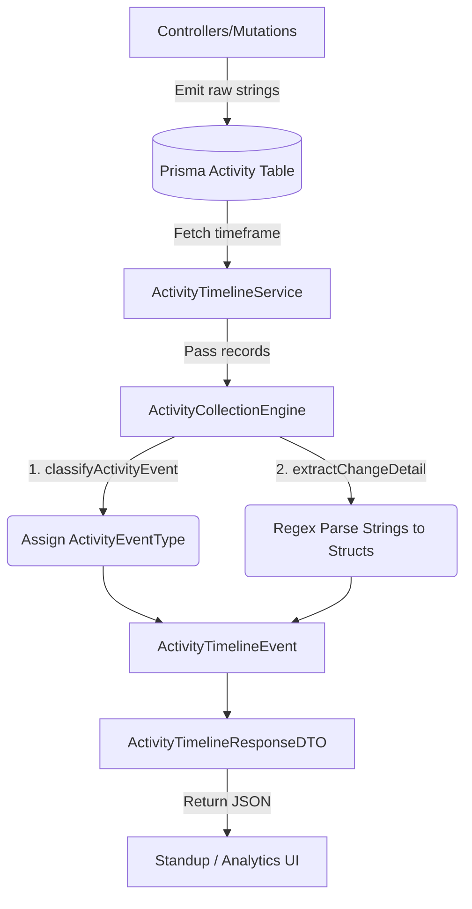

# Activity Collection Engine

The Activity Collection Engine is a deterministic subsystem that aggregates, parses, and normalises raw activity data from the database into a structured Timeline for the Smart Standup Generator (and potentially other analytics views).

## 1. Overview

While the `Activity` table in the database is a simple append-only log of system events (Task created, Dependency added, Status updated), it lacks strong typing for downstream AI consumption. The Activity Collection Engine solves this by introducing a strongly typed parsing layer.

### Key Responsibilities
1. **Bulk Fetching**: Querying all activities for a project within a specific time window (`collectForDate` or `collectForRange`).
2. **Classification**: Mapping loose `{ action, entity }` strings into a strict `ActivityEventType` enum.
3. **Change Extraction**: Parsing unstructured `details` text into structured before/after fields (`ActivityChangeDetail`).
4. **Normalisation**: Transforming raw Prisma records into flattened, nested `ActivityTimelineEvent` objects.

---

## 2. Supported Event Types

The engine currently tracks the following 10 event types across the project lifecycle:

| Event Type | Triggers When... | Change Detail Provided |
|---|---|---|
| `TASK_CREATED` | A new task is created | N/A |
| `TASK_UPDATED` | Fallback for generic edits (title, description) | N/A |
| `STATUS_CHANGED` | A task moves between To Do / WIP / Under Review | `from`, `to` |
| `TASK_COMPLETED` | Status changes to "Completed" | `from`, `to` |
| `TASK_REOPENED` | Status changes from "Completed" back to open | `from`, `to` |
| `PRIORITY_CHANGED` | Priority moves between Low / Medium / High / Urgent | `from`, `to` |
| `ASSIGNEE_CHANGED` | A task is reassigned to a different user | `from`, `to` |
| `COMMENT_ADDED` | A user adds a comment (Prepared for future use) | `commentText` |
| `DEPENDENCY_CREATED` | A task dependency link is created | `predecessorId`, `successorId`, `dependencyType` |
| `DEPENDENCY_REMOVED` | A task dependency link is removed | `predecessorId`, `successorId` |

---

## 3. Architecture & Data Flow



---

## 4. Usage Example

### Direct Querying (Service Layer)

```typescript
import { activityTimelineService } from "../services/activityTimelineService";

// Fetch today's activity
const timeline = await activityTimelineService.getTimeline(projectId);

// Fetch a range of activity
const range = await activityTimelineService.getTimelineRange(projectId, "2026-06-01", "2026-06-07");
```

### Extracted Change Example

If a controller emits:
`{ action: "UPDATED", entity: "Task", details: "Task priority changed from High to Urgent" }`

The engine normalises this to:
```json
{
  "eventType": "PRIORITY_CHANGED",
  "summary": "Task priority changed from High to Urgent",
  "changeDetail": {
    "kind": "PRIORITY_CHANGED",
    "from": "High",
    "to": "Urgent"
  }
}
```

This structure guarantees that the Smart Standup Generator (or any future UI component) doesn't have to write error-prone string-matching code.

---

## 5. Adding New Events in the Future

To add a new tracked event (e.g. `SPRINT_CREATED`):

1. **Emit the log in your Controller**:
   ```ts
   await prisma.activity.create({ data: { action: "CREATED", entity: "Sprint", details: "..." } });
   ```
2. **Add to `ActivityEventType` type** in `client/src/types/index.ts` and `ActivityCollectionEngine.ts`.
3. **Update `classifyActivityEvent`** in `ActivityCollectionEngine.ts` to recognise `entity === "Sprint"`.
4. **Update `extractChangeDetail`** (if you need structured metadata extraction).
5. **Add to summary counters** (if you want it exposed at the top-level API response).
